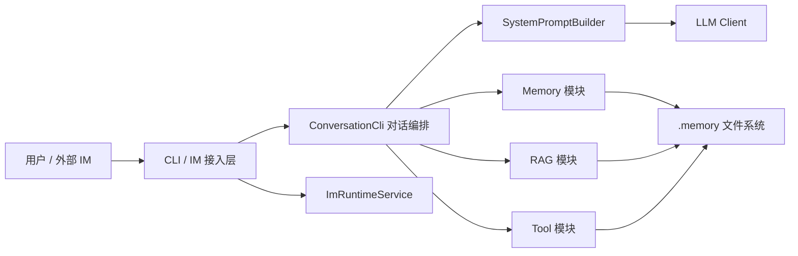
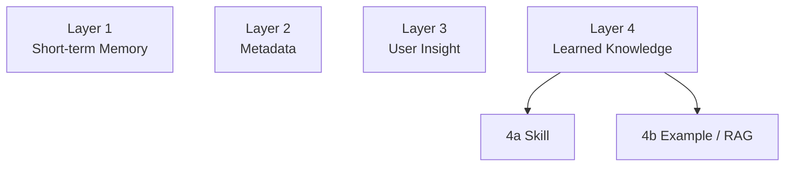
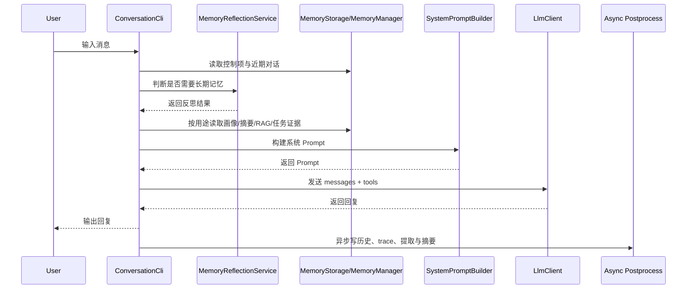
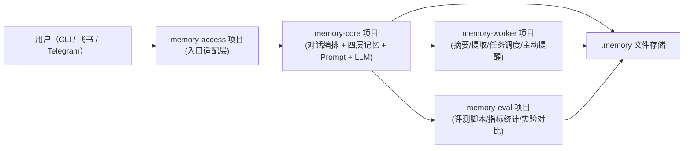
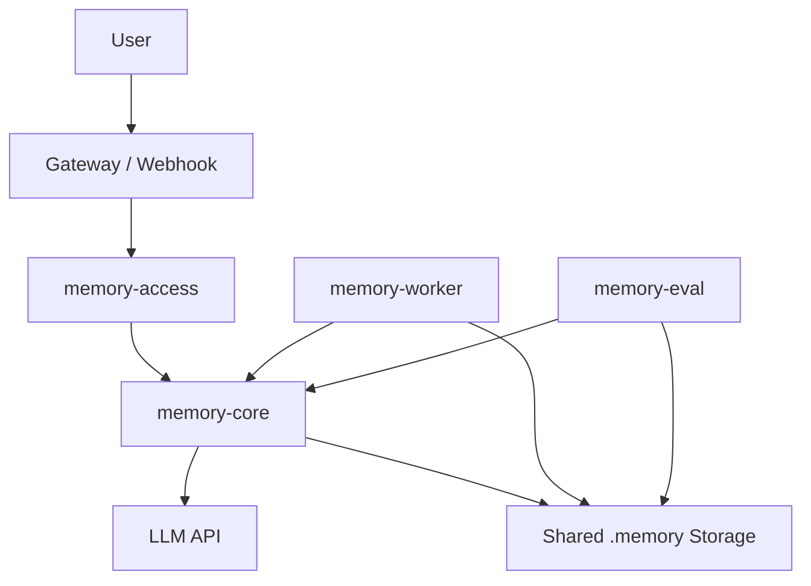
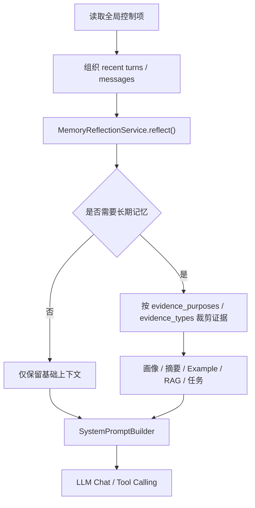
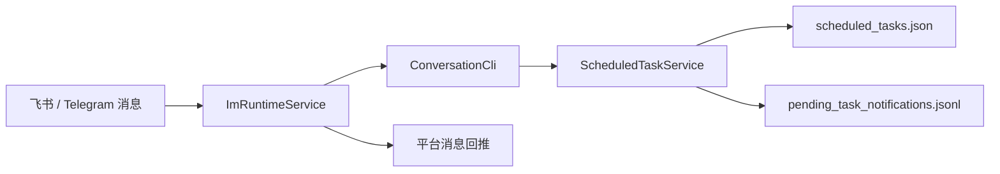
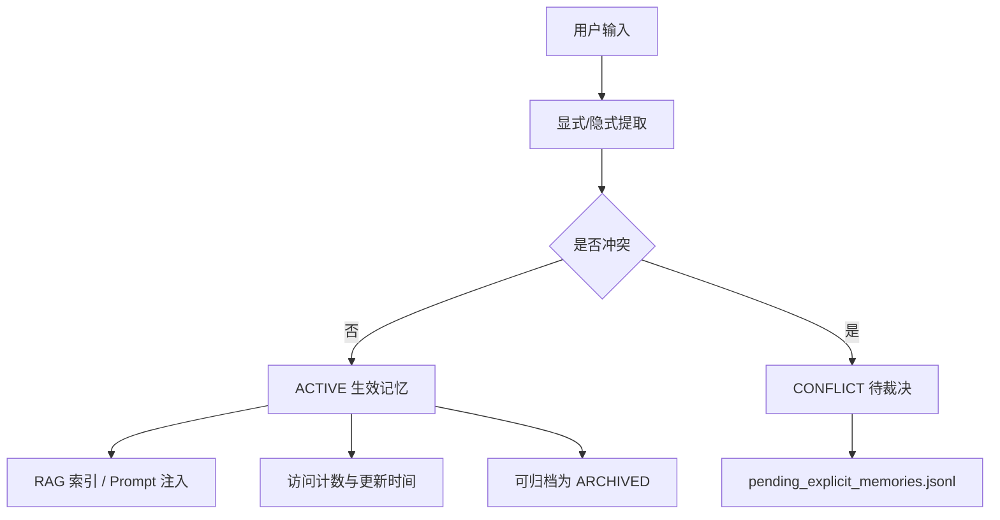
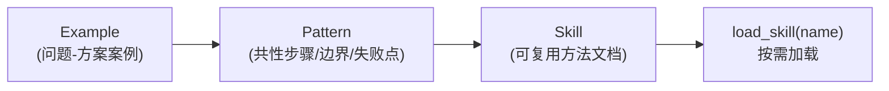

# 基于四层记忆架构的智能记忆管理系统设计与实现

## 摘要

随着大语言模型在问答助手、编程助手和个人智能体等场景中的广泛应用，用户对系统连续对话能力、长期个性化能力以及历史经验复用能力提出了更高要求。然而，单纯依赖模型上下文窗口的对话系统通常存在历史信息易遗失、用户画像难沉淀、过往案例难复用等问题，导致系统在多轮长期交互中表现不稳定。针对上述问题，本文设计并实现了一种基于四层记忆架构的智能记忆管理系统 Memory Box。该系统以 Java 与 Spring Boot 为基础框架，以 LangChain4j 和 OpenAI 格式接口为模型接入方式，围绕短期记忆、元数据、用户洞察和持续学习知识四个层次构建统一的记忆组织机制，并通过 Skill 按需加载、向量检索增强生成、工具调用和 IM 接入等能力实现工程化落地。

本文分析了智能对话系统在长期交互中的关键问题，并提出四层记忆架构，将即时上下文、静态偏好、长期画像和可复用经验分层管理，以降低信息混杂带来的维护成本。在工程实现上，当前版本完成了 CLI 对话主链路、Prompt 条件组装、用户洞察提取、统一写入服务、本地向量检索、定时任务调度以及飞书与 Telegram 接入，并以文件系统作为主要持久化载体。为检查系统的工程可运行性，论文结合单元测试、集成测试以及真实接口回归入口，对存储、对话编排、工具调用和任务提醒等关键链路进行了验证。当前结果主要说明系统已经形成可运行、可检查的工程原型，并为后续 benchmark、指标统计和对照实验提供了运行基础。本文同时给出了从单仓库实现向多项目协同演进的设计思路，用于说明后续扩展时的职责边界，而不表示当前版本已经完成独立部署。

本文的主要贡献包括：提出并实现面向智能体场景的四层记忆架构；设计以 `Agent.md` 为入口的启动导航与按需加载机制；实现单文档用户画像与统一写入；构建 Skill、RAG 与 Tool 的组合增强链路；打通 CLI 与 IM 双入口；给出面向后续扩展的多项目协同演进思路。论文最后给出系统局限与后续优化方向。

关键词：大语言模型；记忆管理系统；四层记忆架构；检索增强生成；智能体

## Abstract

With the rapid adoption of large language models in conversational assistants, coding copilots, and personal agents, users increasingly expect systems to maintain dialogue continuity, retain long-term personalization, and reuse prior experience effectively. However, dialogue systems that rely only on the context window often suffer from unstable long-term memory, weak user profiling, and poor reuse of historical cases. To address these issues, this thesis designs and implements Memory Box, an intelligent memory management system based on a four-layer memory architecture. The system is built with Java and Spring Boot, integrates language models through LangChain4j and OpenAI-compatible APIs, and organizes memory into short-term memory, metadata, user insights, and learned knowledge. It further supports engineering-oriented capabilities such as on-demand Skill loading, retrieval-augmented generation, tool invocation, and IM integration.

This thesis first analyzes the major challenges of long-term interactive intelligent systems and then proposes a four-layer memory architecture to separate real-time context, static preferences, long-term user insights, and reusable experience. This layered design reduces coupling among different information types and improves maintainability. In implementation, the current version provides a CLI-based conversation workflow, conditional prompt assembly, user insight extraction, unified memory writing, local vector retrieval, scheduled task execution, and integration with Feishu and Telegram. The system uses the file system as the primary persistence medium. To check engineering feasibility, unit tests, integration tests, and a real-API regression entry are used to inspect storage, dialogue orchestration, tool invocation, and scheduled reminder workflows. The current evidence mainly shows that the project has formed a runnable and inspectable engineering prototype, while benchmark completion, metric consolidation, and comparative experiments still require further work. In addition, this thesis presents an evolvable multi-project design path from the current single-repository implementation to later collaborative deployment, rather than claiming that the current version has already been split into independently deployed services.

The main contributions of this work are as follows. First, it proposes and implements a practical four-layer memory architecture for agent-oriented systems. Second, it introduces a startup navigation and on-demand loading strategy centered on `Agent.md`. Third, it realizes a single-document user profile mechanism with unified memory writing. Fourth, it builds a composite enhancement framework that combines Skills, RAG, and Tools. Fifth, it unifies CLI and IM channels into a single conversation processing pipeline. Sixth, it provides a multi-project evolution path for later expansion. Finally, the thesis discusses current limitations and outlines future directions, including multimodal memory, finer-grained memory governance, and multi-terminal collaboration.

Keywords: large language model; memory management system; four-layer memory architecture; retrieval-augmented generation; intelligent agent

## 第1章 绪论

### 1.1 研究背景

大语言模型具备较强的语言理解与生成能力，已经能够在客服、办公、编程、教育和个人助理等场景中承担复杂交互任务。但在实际应用中，用户与系统之间往往不是一次性问答，而是持续、多轮、跨时间跨度的长期交互。此类交互要求系统不仅能理解当前输入，还应能够结合用户过往偏好、任务上下文、历史经验以及环境信息生成更准确、更个性化的响应。

目前多数基于大语言模型的对话系统仍主要依赖上下文窗口保存信息。这种方式虽然实现简单，但存在明显局限：一是上下文窗口容量有限，长对话中早期信息会被截断；二是不同类型的信息混杂在一起，难以区分即时上下文与长期记忆；三是用户偏好和历史案例难以被结构化管理；四是随着系统功能增加，Prompt 组装逻辑容易失控，系统可维护性下降。对于希望构建长期可用智能体系统的工程实践而言，单纯扩大上下文并不能从根本上解决记忆问题。

因此，如何为大语言模型设计一套结构清晰、可持续演进、可验证且易于落地的记忆机制，成为智能体工程中的一个重要研究方向。本文围绕这一问题，以实际项目 Memory Box 为研究对象，对记忆系统进行分层设计与工程实现。

### 1.2 研究意义

本文的研究意义主要体现在以下几个方面。

在理论层面，本文将对话信息按语义性质与生命周期划分为四层，形成了清晰的记忆分层模型。在工程层面，论文围绕“可实现、可验证”组织系统实现，完成了基于 Java、Spring Boot、LangChain4j、本地向量检索、文件持久化和 IM 接入的原型系统。在应用层面，系统可用于编程助手、个人助理、知识管理与任务提醒等需要长期连续交互的场景。

### 1.3 国内外研究现状

当前围绕大语言模型记忆能力的研究主要集中在三类思路。第一类是上下文压缩与摘要机制，通过摘要减少历史对话占用的上下文长度；第二类是外部记忆机制，通过数据库、向量库或文件系统将对话信息外置保存；第三类是智能体框架中的长期记忆设计，将用户画像、任务状态和工具结果纳入统一管理。

代表性工作方面，`Generative Agents` 强调“观察-反思-规划”闭环，把自然语言记忆、反思摘要和行为规划结合起来[2]；`MemoryBank` 引入基于遗忘曲线的记忆更新机制，关注长期陪伴场景中的记忆保留与衰减[3]；`LongMem` 从模型结构角度提出“主干模型+记忆检索侧网络”的长程记忆增强方案[4]；`MemGPT` 借鉴操作系统分层内存思想，通过虚拟上下文管理突破窗口限制[5]；`A-MEM` 则进一步提出由代理自主组织、链接和演化记忆网络的机制[6]。此外，最新综述工作系统整理了 LLM Agent 记忆模块的设计维度、评测方式与应用场景[7]。

总体而言，现有研究在长期记忆机制方面进展显著，但不少方案仍以研究原型为主，工程部署成本较高。本文工作侧重系统工程实现：以文件系统为统一记忆载体，在四层架构基础上补充治理、审计与评测能力，并给出多项目协同部署的演进路线。

基于此，本文选取文件系统与本地向量索引作为主要持久化手段，在保证系统可实现和易维护的前提下，探索一种适合毕业设计场景的智能记忆系统实现方案。

### 1.4 研究内容

本文围绕 Memory Box 系统开展研究，主要内容包括：

1. 分析长期对话系统对记忆能力的需求，提出四层记忆架构。
2. 设计系统总体架构、模块划分、数据存储方式与 Prompt 组装策略。
3. 实现对话主链路、用户洞察提取、统一记忆写入、Skill 按需加载、RAG 检索、定时任务和 IM 接入等核心功能。
4. 给出多项目协同架构、部署数据流与模块边界设计，为后续工程扩展提供路线。
5. 构建测试方案，对系统关键模块进行验证，并分析测试结果。
6. 总结系统的实际效果、存在问题与后续优化方向。

### 1.5 论文结构

全文共分为七章。第1章介绍研究背景、意义、现状与本文工作。第2章介绍系统实现依赖的关键技术。第3章分析系统需求与可行性。第4章阐述系统总体设计。第5章说明系统详细设计与实现。第6章给出系统测试与结果分析。第7章总结全文工作并讨论不足与展望。摘要与 Abstract 分别概括中文和英文研究内容。

## 第2章 相关技术与理论基础

### 2.1 Spring Boot 框架

Spring Boot 是面向 Java 应用开发的快速构建框架，能够提供自动装配、配置管理、依赖注入和组件化开发能力[8]。本文系统采用 Spring Boot 3.2.0 作为基础框架，用于组织 CLI、IM、Task、Memory、RAG、Prompt 与 LLM 等模块。借助其组件管理与配置机制，系统可以将对话编排、定时调度和外部接口集成为统一运行时。

### 2.2 LangChain4j 与 OpenAI 格式接口

LangChain4j 是 Java 生态下较常用的大模型应用开发库，支持聊天模型、工具调用、嵌入模型和结构化输出等能力[9]。本文通过 LangChain4j 接入兼容 OpenAI 协议的模型接口[10]，完成以下工作：一是发送基础聊天请求；二是实现带工具的多轮对话；三是基于 Schema 获取结构化提取结果；四是接入本地嵌入模型完成语义检索。

### 2.3 检索增强生成技术

检索增强生成（Retrieval-Augmented Generation，RAG）是一种通过外部知识检索增强模型回答质量的方法[1]。其典型流程包括文本向量化、相似度检索和上下文注入。本文将 RAG 用于召回历史记忆和案例经验：系统将用户洞察与案例内容写入 `vector_store.json`，在对话中根据当前消息执行相似度检索，再将相关结果注入 Prompt，从而提升模型在相似问题上的复用能力。

### 2.4 文件系统持久化

与使用关系数据库或专用向量数据库的方案相比，文件系统持久化具有结构直观、便于调试、迁移成本低和人工可读性强等特点。本文系统采用 `.memory/` 目录保存元数据、用户画像、对话历史、任务数据和向量索引等内容。该设计适合中小规模单用户或轻量多入口智能体场景，也方便毕业设计阶段进行功能验证和演示。

### 2.5 异步任务与定时调度

为了避免对话主线程承担过多写入和提取工作，本文使用异步服务处理历史写入、显式记忆提取和访问计数更新等任务。同时，系统结合 Spring 的调度机制实现夜间记忆提取任务和到期提醒任务。该机制既保证了主链路响应效率，又增强了系统的主动服务能力。

### 2.6 IM 接入机制

除 CLI 交互外，本文实现了飞书与 Telegram 接入。接入后，系统可接收外部消息并复用既有对话主链路生成回复，再回推到对应会话。这表明核心逻辑不依赖单一入口，渠道扩展成本较低。

### 2.7 记忆系统相关研究对本文的启发

结合近年的记忆系统研究，本文在工程设计中吸收了以下思路。第一，借鉴 `Generative Agents` 与 `MemGPT` 的分层思想，将“短期上下文、长期记忆、反思判断”分离，避免所有信息直接堆叠到上下文窗口[2][5]。第二，参考 `MemoryBank` 的记忆生命周期视角，在本系统中引入访问计数、冲突队列与状态治理字段，增强记忆更新可控性[3]。第三，参考 `LongMem` 与 `A-MEM` 对“检索与组织”的强调，在工程上采用 `RAG + Skill` 双通道：前者面向案例召回，后者面向方法复用[4][6]。第四，依据综述文献中对评测与可解释性的建议，本文补充了证据视图与指标定义，以支持后续量化评测[7]。

需要说明的是，本文并未复现上述工作中的模型训练或复杂记忆网络结构，而是在毕业设计约束下优先实现“可运行、可验证、可展示”的系统方案。这也是本文与算法研究型工作的边界。

## 第3章 系统需求分析

### 3.1 系统目标

本系统面向长期对话与个性化服务场景，核心目标如下：

1. 在连续多轮对话中保持上下文连续性。
2. 持续沉淀用户偏好、背景和长期习惯。
3. 通过语义检索复用过往经验与案例。
4. 支持工具调用、任务提醒和外部消息入口。
5. 形成可扩展、可维护、可测试的工程结构。

### 3.2 功能需求分析

根据项目仓库与开发文档中的实现说明和接口定义[11][12][13][14]，系统功能需求可归纳如表3-1所示。

| 编号 | 功能需求 | 说明 |
| --- | --- | --- |
| F1 | CLI 对话与命令交互 | 支持用户在终端中发起对话并执行管理命令 |
| F2 | 短期记忆管理 | 保存最近对话和用户输入日志，支撑上下文连续性 |
| F3 | 元数据管理 | 保存交互元数据、全局控制项和界面设置 |
| F4 | 用户洞察提取 | 从用户表达中提取显式记忆与隐式画像 |
| F5 | Skill 按需加载 | 按名称加载方法论类知识，避免全量注入 |
| F6 | RAG 语义检索 | 从历史记忆和案例中召回相关内容 |
| F7 | 工具调用 | 支持 shell、Python、任务创建等工具能力 |
| F8 | 定时任务提醒 | 支持从消息中识别提醒需求并到时触发 |
| F9 | IM 接入 | 支持飞书与 Telegram 消息收发 |

### 3.3 非功能需求分析

系统除功能需求外，还需满足如下非功能要求。

1. 可维护性：模块边界清晰，避免单一类承担过多职责。
2. 可扩展性：能够在保持主链路稳定的前提下新增工具、渠道与记忆能力。
3. 可恢复性：运行数据以文件形式存储，系统重启后应能恢复状态。
4. 可测试性：核心模块应具备单元测试与回归测试基础。
5. 安全边界：对 shell 与 Python 工具进行能力约束，避免任意执行风险。
6. 可读性：持久化文件应尽可能可人工查看与修改。

### 3.4 可行性分析

#### 3.4.1 技术可行性

项目基于 Java 17、Spring Boot、LangChain4j 和本地嵌入模型实现，技术路线成熟，且当前仓库中已经完成核心功能代码与测试。CLI、IM、Task、Memory、RAG 等模块均已具备可运行基础，因此技术上具有可行性。

#### 3.4.2 经济可行性

系统以本地文件系统和本地嵌入模型为主要支撑，不依赖昂贵的数据库与专有基础设施，开发与部署成本较低，适合作为毕业设计项目落地。

#### 3.4.3 运行可行性

系统支持通过 `.env` 和 `application.yml` 进行运行配置，既可在本地 CLI 模式下工作，也可在 IM 服务模式下运行，部署方式简单，运行门槛较低。

## 第4章 系统总体设计

### 4.1 总体架构设计

系统采用分层与模块化结合的架构方式。逻辑主链路遵循 `cli -> memory/rag -> llm -> prompt` 的依赖方向，避免底层模块反向依赖上层交互逻辑。整体上，系统由启动层、交互层、记忆层、检索层、模型层、工具层和扩展接入层构成。

图4-1给出了系统总体架构示意。

### 4.2 四层记忆架构设计

本文将四层记忆作为系统唯一的记忆架构基线。在当前实现里，“层”首先对应回答前的读取边界，而不只是本地目录的静态划分。对话进入 `ConversationCli.generateResponse()` 后，系统先执行记忆反思，再依据 `useSavedMemories && reflection.needs_memory()` 判断本轮是否继续访问长期材料；只有这一条件成立时，后续流程才继续组织 Layer 3 与 Layer 4 的证据。换言之，四层划分既对应不同载体，也规定了这些材料进入本轮 Prompt 的前置条件。

Layer 1 为短期记忆层，对应 `conversation_history.jsonl` 与 `recent_user_messages.jsonl`。前者顺序保存完整对话，后者维护近期用户输入窗口。运行时，最近若干轮完整对话直接通过 `messages` 传给模型；若还需要补充更早历史，系统会优先尝试读取最近几条会话摘要，只有摘要不可用时才退回 `getOlderUserMessages()` 读取较早用户消息。这里的“轮次”不是按固定消息条数切分，而是按用户消息定义边界。`MemoryStorageTest` 中对非成对历史的用例也说明，当前实现并不假定历史记录始终严格成对，而是以用户轮次作为截取依据。

Layer 2 为元数据层，统一保存在 `metadata.json` 中。该层主要包含 `user_interaction_metadata`、`assistant_preferences`、`global_controls` 与 `ui_settings` 等字段。它在运行时会进入 Prompt，但承担的角色更接近控制条件和回复偏好，例如是否启用长期记忆、是否保留聊天历史以及默认输出风格，而不是用于回放用户历史的正文材料。换言之，Layer 2 负责把当前会话的运行边界交代清楚，而不负责承载长期画像本身。

Layer 3 为用户洞察层，当前正文入口已经收敛到 `user-insights.md`。这一层保存较稳定的偏好、背景与习惯，用于支持个性化回答。文件采用“叙述性正文 + 内嵌结构化状态”的组织方式：人工查看时主要阅读 Markdown 正文，程序读取时仍解析 `<!-- memsys:state -->` 注释块中的 `memories`。因此，当前版本虽然把长期画像集中到单一文档中，但程序侧仍保留槽位、时间戳和状态等结构化字段。与之配套的 `pending_explicit_memories.jsonl` 只负责暂存冲突或待裁决的显式记忆，`memory_queues.json` 主要保留访问热度相关的兼容状态，不再承担第二份画像正文。

Layer 4 为持续学习知识层，当前分为 Skill 与 Example/RAG 两部分。`.memory/skills/` 中的 Skill 文档保存可复用的方法文本，运行时不会整体注入 Prompt，只在需要长期记忆且工具可用时向模型暴露 `load_skill(name)` 作为按需读取入口；`vector_store.json` 保存记忆与案例的向量索引，用于相似问题出现时执行检索。证据分流仍发生在 `buildSystemPromptWithEvidence()` 中：当结果偏向 `personalization`、`continuity` 或 `constraint` 时，系统组织画像正文、高频槽位、会话摘要和补充性的语义相关记忆；当结果偏向 `experience` 时，才追加 Example 检索结果；当结果偏向 `followup` 时，才补入任务上下文。就当前实现而言，Layer 3 主要回答“这个用户有哪些较稳定的画像”，Layer 4 则承载“系统过去积累了哪些可以复用的方法与案例”。

图4-2为四层记忆架构示意图。

因此，当前版本中的四层记忆不仅对应本地存储分层，也直接体现在回答前的读取顺序和证据裁剪条件上。

### 4.3 启动导航设计

本文系统并未将所有知识都直接纳入记忆层，而是单独设计了 `Agent.md` 作为会话启动导航文件。该文件不保存用户具体记忆，而用于说明关键上下文文件位置、各类文件职责和默认加载边界。通过在新会话开始时自动加载 `Agent.md`，系统能够在最小上下文开销下快速建立工作地图，从而降低 Prompt 膨胀风险。

### 4.4 模块划分

系统主要模块及职责如表4-1所示。

| 模块 | 主要类 | 职责 |
| --- | --- | --- |
| 启动模块 | `MemoryBoxApplication` | 初始化 Spring Boot 应用与调度能力 |
| CLI 模块 | `CliRunner`、`ConversationCli` | 提供终端交互、命令路由和对话主编排 |
| Prompt 模块 | `AgentGuideService`、`SystemPromptBuilder` | 负责启动导航与系统提示词组装 |
| 记忆模块 | `MemoryStorage`、`MemoryManager`、`MemoryWriteService`、`MemoryExtractor` | 负责记忆读写、队列维护、提取与持久化 |
| 检索模块 | `RagService` | 提供向量索引、检索与统计能力 |
| 工具模块 | `BaseTool` 及其子类 | 为模型提供按需工具调用能力 |
| 任务模块 | `ScheduledTaskService`、`ScheduledTaskReminderJob` | 负责提醒任务创建与触发 |
| IM 模块 | `ImRuntimeService` 及平台适配类 | 提供飞书与 Telegram 接入能力 |
| 模型模块 | `LlmClient`、`LlmExtractionService` | 提供聊天、结构化提取和工具轮转 |

### 4.5 数据存储设计

当前版本的主要运行数据集中保存在 `.memory/` 目录。系统启动时，`MemoryStorage` 会初始化根目录、`scopes/` 子目录以及对话主链路直接依赖的若干文件，因此长期画像、对话历史、治理记录、摘要结果和评测记录都以本地文件形式保留下来。表4-2列出了当前实现中较有代表性的存储载体。

| 文件名 | 作用 |
| --- | --- |
| `metadata.json` | 保存元数据、偏好、控制项与 UI 设置 |
| `user-insights.md` | 保存用户长期画像正文 |
| `conversation_history.jsonl` | 保存完整对话历史 |
| `recent_user_messages.jsonl` | 保存近期用户输入日志 |
| `session_summaries.jsonl` / `topic_summaries.jsonl` / `milestone_summaries.jsonl` | 保存不同粒度的摘要结果 |
| `memory_evidence_traces.jsonl` | 保存回答前反思与证据使用记录 |
| `memory_queues.json` | 保存 Top of Mind 队列兼容状态 |
| `pending_explicit_memories.jsonl` | 保存显式记忆冲突记录 |
| `vector_store.json` | 保存向量索引与案例内容 |
| `scheduled_tasks.json` | 保存待执行提醒任务 |
| `pending_task_notifications.jsonl` | 保存待回推任务通知 |
| `identity_mappings.json` | 保存跨端统一身份映射 |
| `benchmark_questions.txt` / `benchmark_reports.jsonl` | 保存默认题集与批次汇总 |

当前存储实现区分默认作用域与非默认作用域。默认情况下，相关文件直接写在 `.memory/` 根目录；当用户切换到团队等非默认作用域后，除 `identity_mappings.json` 这类全局文件外，其余数据会写入 `.memory/scopes/<scope>/`。`MemoryStorageTest` 中的作用域隔离用例表明，默认作用域与团队作用域的历史数据不会互相混写，因此本文仅将其界定为当前版本已经具备的文件级隔离机制。

不同文件的格式与职责也有明确区分。`user-insights.md` 是长期画像的唯一正文入口，文件前部保留 front matter，中部为叙述性画像正文，文末再通过 `<!-- memsys:state -->` 注释块保存结构化状态；若启动时检测到旧版 `user_insights.json`，系统会先迁移生成新的 Markdown 文档，并保留 `user_insights.json.migrated.bak` 备份。`conversation_history.jsonl` 采用顺序追加方式保存完整对话，`recent_user_messages.jsonl` 维护近期用户输入窗口；为避免换行符和分隔符破坏单行结构，消息内容会先编码后再写入。待处理显式记忆、证据 trace、摘要记录和 benchmark 汇总则分别保存在独立的 JSONL 或文本文件中，以区分画像正文、运行痕迹与待裁决数据。

在文件落盘方式上，当前实现同时采用追加写和覆盖写两类策略。`conversation_history.jsonl`、`pending_explicit_memories.jsonl` 与 `memory_evidence_traces.jsonl` 更接近顺序日志，因此采用追加写；`user-insights.md` 与 `recent_user_messages.jsonl` 更新时会先写入临时文件，再执行替换；任务通知在读取时也会先将原文件移动到临时路径后再逐行清空处理。结合旧画像迁移、异常记录跳过、多行文本往返以及摘要和 benchmark 文件初始化等测试，可以据实说明当前版本已经形成面向记忆主链路的文件存储基础。

### 4.6 核心流程设计

对话处理流程如图4-3所示。

当前主链路由 `ConversationCli.processUserMessage()` 负责编排。系统先读取全局控制项，决定是否启用长期记忆和历史上下文，再通过 `getRecentConversationTurns()` 组织最近若干轮消息。若长期记忆开关开启，主链路不会直接整包读取 `.memory/` 内容，而是先调用 `MemoryReflectionService.reflect()` 判断本轮是否需要长期记忆支持，以及记忆用途更接近个性化、连续性约束、经验复用还是后续跟进。

在得到反思结果后，`buildSystemPromptWithEvidence()` 才继续执行证据装配。该方法依据 `evidence_purposes` 与 `evidence_types` 进一步计算 `needsInsightEvidence`、`needsExperienceEvidence` 和 `needsFollowupEvidence`，分别决定是否读取 `user-insights.md`、Top of Mind 记忆、最近摘要、Example/RAG 检索结果和任务上下文。若摘要可用，系统优先用最近摘要压缩较早历史；只有摘要不足时，才回退到 `getOlderUserMessages()` 补充较早用户表达。由此，四层记忆在运行时体现为条件读取与按用途裁剪，而不是固定模板的全量拼接。

回答生成完成后，主链路再把不影响即时响应的步骤提交到异步后处理队列。当前实现中，这些步骤包括更新近期消息窗口、追加完整对话历史、写入 `memory_evidence_traces.jsonl`、提取显式记忆、更新访问热度、生成会话摘要或话题切换摘要，以及从当前输入中尝试抽取提醒任务。评测专用入口 `processUserMessageWithMemoryForEval()` 会复用反思和证据组织逻辑，但不执行这些落盘副作用，因此其作用更接近可比较的回答生成链路，而不是完整运行态。整体来看，系统把“回答前读取什么”和“回答后沉淀什么”拆成前后两个阶段，以减少实时回答路径上的额外开销。

### 4.7 多项目协同架构设计

当前实现采用“单仓库、模块化分层”方式，便于快速开发与调试。为了支持后续规模化扩展，本文进一步给出可演进的多项目协同架构，将当前能力拆分为可独立部署的四类项目：入口接入项目、记忆核心项目、任务与主动服务项目、评测观测项目。该设计既保持四层记忆架构不变，也便于按需扩容和独立迭代。

图4-4给出了多项目协同架构示意。

该多项目方案强调“逻辑解耦而非能力重写”。其中 `memory-core` 仍是系统主链路，负责记忆反思、证据组织与模型调用；`memory-access` 负责不同入口协议适配；`memory-worker` 承担异步任务与周期任务；`memory-eval` 提供指标计算和实验复现实验入口。通过这种拆分方式，可在毕业设计阶段先完成单仓库实现，在工程扩展阶段平滑迁移到多项目部署。

为便于工程实施，表4-3给出多项目拆分后的职责边界与技术映射。

| 项目 | 核心职责 | 对应当前模块 | 说明 |
| --- | --- | --- | --- |
| `memory-access` | 渠道接入、协议适配、消息标准化 | `im`、`cli` | 仅负责输入输出，不承载记忆决策 |
| `memory-core` | 对话编排、Prompt 构建、四层记忆读写 | `cli`、`prompt`、`memory`、`rag`、`llm` | 主业务核心，保持高内聚 |
| `memory-worker` | 异步提取、摘要、定时任务、主动提醒 | `memory`、`task` | 支持独立扩缩容，降低主链路压力 |
| `memory-eval` | 评测集运行、对比实验、统计汇总 | `eval` | 面向论文实验与持续回归 |

图4-5给出多项目部署与数据流示意。

在工程推进上，多项目架构不要求一次性重构完成。本文建议采用“先逻辑解耦、再服务拆分、最后独立部署”的渐进路线。表4-4给出建议迁移步骤。

| 阶段 | 目标 | 关键动作 | 预期结果 |
| --- | --- | --- | --- |
| Stage 1 | 单仓库逻辑解耦 | 固化包边界与接口，减少跨模块调用 | 代码结构可拆分 |
| Stage 2 | 进程内组件拆分 | 将 access/core/worker/eval 分离为独立启动入口 | 可独立调试与回归 |
| Stage 3 | 多服务部署 | 通过 HTTP/消息队列连接 core 与 worker/eval | 主链路与异步链路解耦 |
| Stage 4 | 资源弹性扩展 | 按流量独立扩容 access/core，按任务量扩容 worker | 性能与成本更可控 |

与单仓库模式相比，多项目协同的优势主要体现在职责隔离、扩展效率和运行稳定性。表4-5给出两种模式的对比。

| 对比维度 | 单仓库模式 | 多项目协同模式 |
| --- | --- | --- |
| 代码组织 | 开发效率高，但模块边界易被打破 | 边界清晰，适合团队协作 |
| 部署方式 | 一体化部署简单 | 可按服务独立发布与回滚 |
| 扩缩容 | 整体扩容，资源利用率一般 | 按入口/核心/任务分别扩缩容 |
| 故障影响面 | 单点故障可能影响全链路 | 异步链路故障可被隔离 |
| 评测与实验 | 易与业务耦合 | eval 可独立运行，实验复现性更好 |

### 4.8 多项目接口与部署建议

为确保多项目方案可直接落地，需在拆分前定义稳定的服务边界与接口约定。表4-6给出建议的服务间接口。

| 调用方向 | 接口示例 | 请求核心字段 | 返回核心字段 | 说明 |
| --- | --- | --- | --- | --- |
| `access -> core` | `POST /api/chat` | `user_id`、`message`、`source` | `reply`、`trace_id` | 统一对话入口 |
| `core -> worker` | `POST /api/jobs/memory-extract` | `trace_id`、`conversation_slice` | `accepted` | 异步触发提取与摘要 |
| `core -> worker` | `POST /api/jobs/task-scan` | `trace_id`、`user_message` | `accepted` | 异步识别提醒任务 |
| `eval -> core` | `POST /api/eval/run` | `dataset_id`、`mode` | `score_summary` | 评测运行与汇总 |
| `worker -> access` | `POST /api/notify/push` | `conversation_id`、`content` | `delivered` | IM/CLI 通知回推 |

在部署层面，毕业设计阶段可采用单机多进程模式；若进入真实使用场景，可按流量与任务量独立扩容。表4-7给出建议资源策略。

| 服务 | 负载特征 | 资源建议 | 扩容信号 |
| --- | --- | --- | --- |
| `memory-access` | 高并发短请求 | 中等 CPU，低内存 | QPS 持续升高、入口排队增加 |
| `memory-core` | LLM 调用与上下文组装 | 高 CPU，中高内存 | 平均响应时延升高 |
| `memory-worker` | 异步批处理与定时任务 | 中 CPU，中内存 | 待处理任务堆积 |
| `memory-eval` | 批量离线评测 | 按批次临时扩容 | 评测窗口内耗时超阈值 |

## 第5章 系统详细设计与实现

### 5.1 对话主编排与 Prompt 构建

系统对话主入口为 `ConversationCli.processUserMessage()`。该方法负责接收用户输入、读取控制项、整理最近对话、执行记忆反思、构造 Prompt、调用模型并在对话结束后安排异步记忆任务。该类是 CLI、IM 和定时提醒回流的统一对话主链路，因此在整个系统中承担对话编排枢纽的作用。

具体而言，该方法会先读取 `metadata.json` 中的全局控制项，根据 `use_saved_memories` 和 `use_chat_history` 决定是否启用长期记忆与历史上下文；随后从 `conversation_history.jsonl` 中按用户轮次边界抽取最近十轮完整对话，组织为 `messages` 上下文，并将当前用户消息追加到消息列表末尾。若长期记忆开关开启，主链路不会直接整包读取画像、Skill 和 RAG 结果，而是先调用 `MemoryReflectionService.reflect()` 判断本轮是否需要长期记忆，以及证据用途更接近个性化、连续性约束、经验复用还是后续跟进。

在得到反思结果后，`buildSystemPromptWithEvidence()` 才继续装配当前轮次所需证据。该方法会根据 `evidence_purposes` 与 `evidence_types` 计算 `needsInsightEvidence`、`needsExperienceEvidence` 和 `needsFollowupEvidence`，再分别决定是否读取画像正文、摘要、Example/RAG 结果、任务上下文以及可用工具列表。`SystemPromptBuilder` 负责将这些已经裁剪过的材料组织为系统提示词，并单独写入“记忆反思决策”小节。因此，当前实现中的 Prompt 构建更接近“按条件组装”，而不是每轮固定注入所有长期材料。

图5-1给出 Prompt 组装流程。

### 5.2 记忆存储与迁移机制

`MemoryStorage` 在实例化时会执行 `initializeStorage()`。这一过程先建立 `.memory/` 根目录和 `scopes/` 子目录，再补齐当前运行期直接依赖的文件，包括 `metadata.json`、`conversation_history.jsonl`、`recent_user_messages.jsonl`、`memory_queues.json`、`pending_explicit_memories.jsonl`、三类摘要文件、任务文件、证据 trace 文件以及 benchmark 相关文件。结合当前代码可以看出，系统没有另外引入独立数据库或单独的存储服务，而是把主链路所需状态统一落在文件系统中。

长期画像的迁移与收敛也发生在启动阶段。系统先检查早期版本中的 `implicit_memories.json`，若该文件仍存在且 `user_insights.json` 尚未建立，则先完成一次重命名；随后 `initializeUserInsightsDocument()` 再判断 `user-insights.md` 是否已经存在。若 Markdown 画像文档尚未建立，而旧的 `user_insights.json` 仍保留，则系统读取旧槽位数据，生成新的 `user-insights.md`，并将原文件转存为 `user_insights.json.migrated.bak`。`MemoryStorageTest` 中的迁移用例覆盖了这条路径，因此本文只能据实表述为：当前版本已经把长期画像正文收敛到 Markdown 文档，旧 JSON 文件只承担迁移来源和备份角色。

`user-insights.md` 在当前实现中属于“正文与状态并存”的混合文档。文件前部保留 front matter，中间正文由 `buildNarrative()` 根据现有记忆重写为叙述性描述，文末再通过 `<!-- memsys:state -->` 注释块保存结构化 `memories`。程序在回读画像时，并不是直接解析正文段落，而是通过 `parseUserInsightsDocument()` 从注释块恢复槽位名、时间戳、状态和验证信息。因此，现阶段的画像文档既是论文中可以描述的长期画像载体，也仍然保留了程序运行所需的结构化状态。

短期记忆继续采用 JSONL 文件保存。`conversation_history.jsonl` 负责顺序追加完整对话，`recent_user_messages.jsonl` 负责维护近期用户输入窗口。为了避免换行符和分隔符破坏单行结构，消息写入前会先经过编码。读取最近上下文时，`getRecentConversationTurns()` 不是简单按照消息条数截断，而是先定位最近若干个用户轮次，再返回从该轮次起到文件末尾的完整消息片段；读取更早历史时，`getOlderUserMessages()` 只抽取更早轮次中的用户消息。`MemoryStorageTest` 中关于多行文本、异常时间戳和非成对历史的用例，覆盖的正是这一类边界。

不同文件的落盘方式并不完全相同。`user-insights.md` 与 `recent_user_messages.jsonl` 更新时会先写入临时文件，再执行替换；`conversation_history.jsonl`、`pending_explicit_memories.jsonl` 和 `memory_evidence_traces.jsonl` 更接近顺序日志，因此继续采用追加写。当前测试还能确认一项较为具体的事实：在读取历史、待处理记录和证据 trace 时，畸形行会被跳过，而不是直接导致整个文件读取失败。基于这些实现与测试，本文能够说明当前版本已经形成面向记忆主链路的文件存储基础，但尚不能把它写成完整的性能优化或稳定性实验结论。

### 5.3 用户洞察提取与统一写入

用户洞察提取在当前版本中并不是单一路径。代码里至少存在三类入口：一类是常规对话后的显式提取，`ConversationCli` 在回答完成后的异步流程中对当前用户消息调用 `extractExplicitMemory()`；一类是手动 `/memory-update`，由 CLI 读取最近 7 天历史后调用 `extractUserInsights(..., "manual")`；另一类是夜间任务，`NightlyMemoryExtractionJob` 同样回看最近 7 天对话并执行批量提取。三类入口的共同点在于，最先得到的都只是候选条目，而不是直接写入最终画像正文。

在职责划分上，`MemoryExtractor` 负责组织提取流程并补齐默认字段，真正发起结构化提取请求的是 `LlmExtractionService`。显式场景下，系统优先让模型返回 `has_memory`、`slot_name`、`content`、`memory_type` 和 `source` 等字段；如果结构化调用失败，再退回旧的 JSON 解析逻辑。隐式场景下，`extractUserInsights()` 返回的重点是候选的 `slot_name`、`content` 和 `confidence`，之后再由 `MemoryExtractor` 补齐 `memory_type`、`source`、`hit_count`、`created_at` 和 `last_accessed` 等运行态字段。因此，当前实现中的“提取”与“构造成可落盘对象”仍是前后衔接的两步，而不是一次完成。

显式记忆在写回前还保留了一层较窄的类型收束。`ConversationCli.handleExplicitMemory()` 在正式落盘前会调用 `parseMemoryType()`，但该方法当前直接返回 `USER_INSIGHT`。这意味着，即使提取结果中仍保留 `memory_type` 字段，现阶段真正进入正文画像的显式记忆仍统一归到用户洞察，不再拆分出新的正文类别。

候选条目的正式写回由 `MemoryWriteService` 负责。该服务会构造 `Memory` 对象，设置 `createdAt`、`lastAccessed`、`status` 和验证信息，随后调用 `storage.writeUserInsight()` 写入 `user-insights.md`，再通过 `MemoryManager.updateAccessTime()` 更新访问时间与队列状态；当 RAG 开启且记忆状态为 `ACTIVE` 时，系统还会把该条目写入向量索引。就当前实现而言，“统一写入”主要是指正式落盘、访问热度维护和可选索引更新被收敛到同一服务中，而不是所有提取入口已经完全共享同一套治理策略。

冲突处理的位置目前仍随入口不同而变化。常规对话中的显式记忆先由 `handleExplicitMemory()` 检查同名槽位；若内容相同则直接跳过，若内容不同则把新旧内容写入 `pending_explicit_memories.jsonl`，等待人工处理。夜间隐式提取会调用 `saveMemoryWithGovernance(..., true)`，由写入服务在内部完成冲突检测；手动 `/memory-update` 当前仍逐条调用 `saveMemory()`，不会在这一步开启冲突检测。换言之，提取组件和正式写回组件已经复用，但治理入口还没有完全收敛到同一位置。

人工审批仍是当前链路中的必要环节。`approvePendingExplicitMemory()` 会先检查待处理记录是否至少包含 `slot_name` 与 `new_content`，校验通过后再回写 `user-insights.md`，并把 `verified_source` 更新为 `manual_cli_approval`。`MemoryWriteServiceTest` 已覆盖批准成功和畸形记录拒绝这两类情况。因此，本文在这一部分只能据实现说明：系统已经具备“候选提取、正式写回、冲突入队、人工批准回写”的基础路径；至于提取质量、冲突消解效果和治理效率，当前版本还缺少可以直接写入论文正文的量化实验依据。

### 5.4 Skill、RAG 与工具调用机制

持续学习知识层在当前实现中主要拆分为 Skill 与 Example/RAG 两部分。Skill 以 Markdown 文件形式保存在 `.memory/skills/` 目录下，由 `SkillService` 负责列举、读取、保存和删除；但在对话主链路中，系统并不会把所有 Skill 正文一次性注入 Prompt，而只会先输出可用 Skill 名称，再在需要时通过 `load_skill(name)` 按名称读取正文。`SystemPromptBuilder` 中的“Skill 加载策略”正是按这一方式组织的，因此 Skill 更接近可按需调用的方法库，而不是每轮都要携带的固定上下文。

RAG 能力由 `RagService` 提供。该服务以单文件 `vector_store.json` 作为向量索引载体，支持记忆索引、Example 索引、语义检索和索引重建，并且会根据当前作用域过滤可见文档。实现上，记忆内容先被写入向量索引，再在 `ConversationCli` 中按当前问题执行 `buildSmartContext()` 或 `searchExamples()`；命中的条目随后才会进入系统提示词中的“语义相关记忆”或“相关案例”部分。当前实现没有把 RAG 写成独立数据库层，而是把索引、检索和持久化收束在同一个本地文件索引中，便于查看和恢复。

工具能力由 `BaseTool` 及其子类构成，当前主链路会按记忆反思结果决定是否暴露 `load_skill`、`search_rag`、`run_shell`、`run_shell_command`、`run_python_script` 和 `create_task`。其中，`run_shell` 只提供只读检索，`run_shell_command` 需要显式授权后才允许执行命令，`create_task` 则用于把提醒需求转成定时任务。`ConversationCli` 还会通过 `attachToolUsageTracking()` 记录真实调用情况，因此证据视图里能够区分“本轮可用但未使用”的工具与“本轮实际调用过”的工具。对本文系统而言，这一层工具机制的作用不是扩展成通用 Agent 平台，而是在记忆需要被调用时，提供受控的读取、检索和任务触发入口。

### 5.5 IM 接入与定时任务扩展能力

为了证明系统核心能力可复用于多入口场景，本文实现了 IM 接入模块。`ImRuntimeService` 统一处理外部消息，它在收到 `IncomingImMessage` 后会调用 `ConversationCli.processUserMessage()` 获取回复，再根据平台类型调用对应客户端将结果发回。通过该设计，CLI 与 IM 实际上共享同一套对话主逻辑，仅入口和输出渠道不同，体现了系统架构的良好复用性。

在任务能力方面，`ScheduledTaskService` 支持从自然语言中提取提醒需求，也支持由前端直接传入标题、时间和执行命令创建任务。任务被写入 `scheduled_tasks.json` 后，调度器会周期性扫描并触发到期任务。若任务配置了执行命令，系统还会在受控 shell 环境中执行命令并记录输出，随后把触发结果写入待通知队列，供 IM 会话回推。该机制说明系统已经具备一定的主动服务能力，而不仅仅是被动问答系统。

图5-2展示 IM 与任务回流过程。

### 5.6 记忆反思、证据视图与治理机制实现

当前版本把记忆反思放在回答生成之前。`ConversationCli.generateResponse()` 先读取全局控制项；如果 `use_saved_memories` 关闭，主链路直接采用 `ReflectionResult.memoryDisabled()`，后续不再读取画像、摘要、案例和 Skill 等长期材料。只有长期记忆开关开启时，系统才调用 `MemoryReflectionService.reflect()`，并以 `useSavedMemories && reflection.needs_memory()` 作为是否继续访问 Layer 3 与 Layer 4 证据的条件。也就是说，长期材料并不是默认注入，而是先经过一次回答前判断。

`MemoryReflectionService` 负责把 `LlmExtractionService` 返回的结构化结果整理成主链路可直接使用的字段，包括 `memory_purpose`、`reason`、`confidence`、`retrieval_hint`、`evidence_types` 和 `evidence_purposes`。该服务本身不承担检索与写回，只负责归一反思结果。结合 `MemoryReflectionServiceTest` 可以看到，空白 `reason`、空 `retrieval_hint`、不同写法的用途别名以及旧版置信度尺度，都会先在服务内部收束；如果提取失败或返回空对象，则回退到 `ReflectionResult.fallback()`。反思结果回到 `ConversationCli` 后，还会经过 `normalizeRuntimeReflection()` 做一次运行态字段整理，这一步仍在同一条回答链路内完成，不会再次请求模型。

确认需要长期记忆后，`buildSystemPromptWithEvidence()` 才决定本轮实际组织哪些材料。该方法会结合 `evidence_purposes` 与 `evidence_types`，选择是否读取 `user-insights.md`、近期摘要、语义检索结果、Example 案例和任务上下文；当反思结果偏向 `personalization`、`continuity` 或 `constraint` 时，画像正文与摘要材料才会进入 Prompt；当结果偏向 `experience` 时，系统才补入 Example 检索结果；当结果偏向 `followup` 时，系统才补入任务相关上下文。与之对应，`load_skill(name)`、`search_rag(query)` 等工具也只在 `shouldLoadMemory` 成立时向模型暴露。评测专用的 `generateResponseForEvalWithoutTools()` 会复用这套反思与证据组织逻辑，但不会开放工具，也不会把 trace 追加到 `memory_evidence_traces.jsonl`，因此更适合作为对比回答入口，而不是日常运行链路。

回答完成后，系统会把本轮证据使用情况整理为 `MemoryEvidenceTrace`。该记录不参与新记忆生成，而是保存本轮反思结果、是否实际加载长期记忆、检索到的 insight、example、task 与 Skill 名称列表，以及最终被判定为已使用的证据，供 `/memory-debug`、`/memory-review` 等入口回看。常规交互中，主链路先把 trace 保存在 `lastEvidenceTrace`，再在后处理阶段异步追加到 `memory_evidence_traces.jsonl`；评测专用链路也会生成同结构 trace，但只保留在运行态。这里还需要区分 `loaded_skills` 与 `used_skills`：前者表示本轮向模型暴露了哪些 Skill 名称，后者才表示工具实际调用了 `load_skill(name)` 并读取正文。`MemoryEvidenceTrace.buildDisplaySummary()` 输出的是回看与诊断文本，其中包含检索数量、实际使用数量、覆盖率和未使用证据提示，因此更适合作为证据解释入口，而不能直接写成量化评测结果。

在治理部分，当前版本已经形成候选记忆入队、人工批准和画像回写的基础路径，但不同写回入口尚未完全统一。常规对话中的显式记忆由 `handleExplicitMemory()` 先检查同名槽位；内容相同时直接跳过，内容不同时才把新旧内容写入 `pending_explicit_memories.jsonl`，无冲突时再调用 `saveMemory()` 写回画像正文。手动 `/memory-update` 会回看最近 7 天历史，但当前仍逐条调用 `saveMemory()`，没有在统一写入服务中开启冲突检测。夜间隐式提取则通过 `saveMemoryWithGovernance(..., true)` 在统一写入服务内部执行冲突检测，并把冲突项留在待处理队列中。CLI 审批入口先按序号读取待处理记录，再调用 `approvePendingExplicitMemory()` 校验 `slot_name` 与 `new_content`；校验通过后，系统把内容写回 `user-insights.md`，并将 `verified_source` 更新为 `manual_cli_approval`。因此，当前版本更准确的表述是已经具备基础治理路径，而不是所有写回入口都已经统一。

图5-3展示记忆生命周期与治理流程。

### 5.7 案例蒸馏链路设计（面向后续扩展）

当前仓库中与案例复用直接相关的实现主要有两部分。其一，`RagService.indexExample()` 与 `searchExamples()` 已支持把带有 `problem`、`solution` 和 `tags` 的案例写入 `vector_store.json` 并按语义相似度检索。其二，`SkillService` 负责 `.memory/skills/*.md` 的读取、保存和删除，运行时再由 `load_skill(name)` 按名称加载已有 Skill 正文。`ConversationCli.buildSystemPromptWithEvidence()` 只有在记忆反思结果指向 `experience` 用途时才组织 Example 证据，非该场景不会触发案例检索。因此，当前版本已经具备“沉淀案例并在回答时按需复用”的基础入口，但还没有形成从案例自动归纳方法的独立蒸馏链路。

如果后续继续扩展案例学习能力，可以在现有 Example 检索与 Skill 文件载体之间增加 `Pattern` 层，用于整理多条相似案例中的共性步骤、边界条件和失败经验。需要说明的是，这里的 `Pattern` 仍属于后续设想，当前仓库中尚无对应的数据结构、抽取服务或验证流程，因此图5-4只用于说明可能的演进方向，不代表现阶段已经完成该运行链路。

图5-4展示后续可考虑的案例蒸馏演进方向。

### 5.8 毕设项目实现映射

为保证论文与项目实现一致，表5-1给出“设计目标—代码实现—运行载体”的对应关系。该映射可直接用于答辩中说明“每个设计点在仓库中的落地位置”。

| 设计点 | 关键类/模块 | 数据文件或运行载体 | 说明 |
| --- | --- | --- | --- |
| 对话主编排 | `ConversationCli` | `conversation_history.jsonl` | 统一 CLI/IM 的对话入口 |
| Prompt 组装 | `SystemPromptBuilder` | `Agent.md`、`metadata.json` | 负责多源上下文拼装 |
| 记忆读写与迁移 | `MemoryStorage`、`MemoryWriteService` | `.memory/` 目录 | 支持初始化、迁移、治理写入 |
| 用户洞察提取 | `MemoryExtractor`、`LlmExtractionService` | `user-insights.md` | 显式/隐式洞察统一落盘 |
| 语义检索 | `RagService` | `vector_store.json` | 记忆与案例向量检索 |
| 记忆反思与证据 | `MemoryReflectionService`、`MemoryEvidenceTrace` | `/memory-debug` 输出 | 回答前判断与回答后审计 |
| 任务调度 | `ScheduledTaskService`、`ScheduledTaskReminderJob` | `scheduled_tasks.json` | 自然语言任务识别与到期触发 |
| 多入口接入 | `ImRuntimeService` | 飞书/Telegram webhook/长连接 | 与 CLI 共享核心主链路 |

## 第6章 系统测试与结果分析

### 6.1 测试环境

系统测试环境为本地 macOS 开发环境，项目通过 Maven 构建，运行时使用 Java 17 及以上版本。系统依赖的核心框架包括 Spring Boot 3.2.0、LangChain4j 0.35.0 和 JUnit 5。测试过程采用 `mvn test -q` 执行自动化测试。在当前环境下，显式设置 `JAVA_HOME` 后，测试命令可正常通过。

### 6.2 测试内容与方法

为了覆盖系统核心功能，本文将测试分为五类：存储与迁移测试、对话与 Prompt 编排测试、工具调用与任务创建测试、IM 接入与端到端测试、评测对比流程测试。

#### 6.2.1 存储与迁移测试

该类测试主要验证 `MemoryStorage` 是否能正确初始化 `.memory/` 目录、创建默认文件、完成历史数据迁移，并保证用户画像和任务文件的读写正确性。通过该类测试，可以证明系统在首次启动、版本升级和正常运行阶段均具备较好的数据兼容能力。

#### 6.2.2 对话与 Prompt 编排测试

该类测试主要对应 `ConversationCliTest` 与 `SystemPromptBuilderTest`。测试重点包括：首次会话是否注入 `Agent.md` 导航、后续轮次是否避免重复注入；在启用 Skill 时是否正确暴露 `load_skill` 工具；在启用 RAG 时是否正确暴露 `search_rag` 工具；记忆反思开关对记忆加载行为的影响是否符合预期；在临时模式和历史控制开关切换时是否保持对话行为符合预期。

#### 6.2.3 工具调用与任务创建测试

该类测试主要覆盖 `ToolCompositionTest`、`CreateTaskToolTest`、`PythonScriptToolTest`、`ShellCommandToolTest` 和 `ScheduledTaskServiceTest`。其中，`CreateTaskToolTest` 用于验证任务创建接口对时间、命令和去重逻辑的处理；`ShellCommandToolTest` 和 `PythonScriptToolTest` 用于验证工具执行结果；`ScheduledTaskServiceTest` 则验证任务触发、执行输出和通知生成等流程。

#### 6.2.4 IM 接入与端到端测试

该类测试主要包括 `FeishuInboundParserTest`、`TelegramInboundParserTest` 和 `RealApiE2ETest`。前两者验证不同平台入站消息的解析正确性，后者作为真实模型接口端到端回归入口，用于在实际 API 条件下验证完整链路可用性。

#### 6.2.5 评测对比流程测试

该类测试对应 `EvalServiceTest`，重点验证“有记忆模式/无记忆模式”的评测流程是否可执行，确保评测集读取、对话调用与结果汇总链路可复用，为后续论文实验对比提供工程基础。

### 6.3 测试结果分析

依据当前仓库测试结果，系统核心链路已经具备较完整的自动化验证基础。测试覆盖范围涉及存储、记忆管理、Prompt 构建、工具调用、任务调度、IM 消息解析和真实 API 回归等多个方面，能够较全面地证明系统并非停留在架构设计层面，而是完成了实际可运行的工程原型。

表6-1给出主要测试用例与验证目标。

| 测试类 | 验证目标 |
| --- | --- |
| `MemoryStorageTest` | 存储初始化、文件读写、迁移逻辑 |
| `MemoryManagerTest` | 队列访问更新与清理逻辑 |
| `ConversationCliTest` | 对话编排、Skill/RAG/任务工具暴露 |
| `SystemPromptBuilderTest` | Prompt 组装结构与内容 |
| `CreateTaskToolTest` | 任务创建参数解析与任务落盘 |
| `ShellCommandToolTest` | shell 命令执行与输出 |
| `PythonScriptToolTest` | Python 脚本执行能力 |
| `ScheduledTaskServiceTest` | 提醒任务创建、去重、触发与通知 |
| `FeishuInboundParserTest` | 飞书消息解析 |
| `TelegramInboundParserTest` | Telegram 消息解析 |
| `RealApiE2ETest` | 真实模型接口回归 |
| `EvalServiceTest` | 评测集执行与有记忆/无记忆对比流程 |

从功能效果上看，系统已经能够实现以下目标：一是在多轮对话中保持最近上下文连续性；二是在长期交互中逐步形成用户画像；三是在遇到相似问题时通过检索增强复用历史经验；四是通过记忆反思减少无效记忆注入，并通过证据视图解释回答依据；五是在外部消息渠道中复用同一对话主链路；六是在需要时创建并触发提醒任务。因此，本文提出的架构与实现方案在毕业设计场景下是可行且有效的。

### 6.4 存在的测试局限

尽管当前测试基础较完整，但仍存在局限。系统虽已具备 `EvalService` 和评测入口，但尚未形成固定公开数据集与稳定统计报表，当前验证仍以功能正确性为主。真实 API 的端到端测试仍以手动回归为主，自动化程度有待提高。现有测试也主要覆盖单机场景，对多用户并发、跨平台身份合并和长周期稳定性验证仍不充分。

### 6.5 论文实验指标定义

为支持答辩中的量化展示，本文给出可直接落地的指标口径，如表6-2所示。该指标体系与现有 `EvalService` 流程兼容，可在后续版本中通过固定评测集持续产出对比结果。

| 指标 | 定义 | 计算方式（建议） |
| --- | --- | --- |
| 记忆命中率 | 回答中有效使用历史记忆的比例 | `命中样本数 / 总样本数` |
| 约束遵循率 | 是否遵循用户长期偏好和约束 | `遵循样本数 / 约束类样本数` |
| 案例复用率 | 是否复用了历史 Example 或 Skill | `复用样本数 / 复用需求样本数` |
| 任务识别准确率 | 对提醒/待办意图识别是否正确 | `识别正确数 / 任务类样本数` |
| 平均响应时延 | 单轮请求到响应输出的耗时 | `Σ响应时长 / 轮次` |
| 上下文压缩收益 | 摘要机制带来的上下文长度下降比例 | `(压缩前tokens-压缩后tokens)/压缩前tokens` |

结合上述指标，答辩阶段可采用“三组对照实验”统一呈现：无记忆基线、四层记忆基线、增强版（记忆反思+治理+摘要）。该对照方式能够更直观说明本文方案在个性化连续性、记忆可信性和系统可解释性方面的增益。

### 6.6 与代表性记忆系统论文的对比分析

为说明本文工作的定位，表6-3从工程维度对本系统与代表性研究进行对比。本文不涉及复杂训练范式，重点在于记忆机制的系统实现与运行验证。

| 维度 | Generative Agents[2] | MemoryBank[3] | LongMem/MemGPT[4][5] | 本文系统 |
| --- | --- | --- | --- | --- |
| 核心目标 | 行为仿真与社会互动 | 长期对话记忆保留 | 窗口外长程记忆增强 | 工程化记忆管理与多入口复用 |
| 记忆组织 | 自然语言记忆流+反思 | 记忆库+遗忘曲线更新 | 外部记忆/分层内存管理 | 四层记忆（L1-L4）+治理状态 |
| 运行形态 | 研究原型环境 | 陪伴场景原型 | 模型增强框架 | Spring Boot 可运行系统 |
| 可解释与审计 | 部分可解释 | 关注记忆更新 | 关注检索/上下文管理 | 证据视图 + `/memory-debug` |
| 部署演进 | 未强调 | 未强调 | 偏模型侧 | 单仓库到多项目协同路线 |
| 实现重心 | 行为仿真机制 | 记忆更新策略 | 模型侧长程记忆 | 系统工程实现与验证 |

### 6.7 毕设可验收成果与答辩要点

结合当前项目状态，本文可形成以下可验收成果：

1. 架构与流程成果：已形成四层记忆架构，以及“回答前反思判断、回答时条件装配证据、回答后追加 trace 与异步沉淀”的运行链路。
2. 功能与载体成果：已实现 CLI 与 IM 共用的对话主链路，形成 `user-insights.md`、各类摘要文件、`pending_explicit_memories.jsonl`、`memory_evidence_traces.jsonl` 等可回看的记忆载体。
3. 验证与展示成果：已具备自动化测试、真实 API 回归入口、benchmark 与评测入口，以及 `/memory-debug`、`/memory-report`、`/memory-governance` 等演示命令。

答辩展示更适合按“问题场景 - 运行路径 - 工程证据”展开。首先说明仅依赖短上下文时，系统难以稳定保持长期偏好、历史约束和任务延续；随后结合四层记忆与记忆反思，展示本轮回答是在什么条件下继续读取画像、摘要、案例或任务上下文；最后以 `/memory-debug`、`memory_evidence_traces.jsonl`、待处理记忆队列和任务触发结果作为证据，说明当前版本已经具备可回看、可检查的工程实现。对于回答质量提升、指标增益和大规模对照实验结果，仍需在后续实验阶段继续补充。

## 第7章 总结与展望

### 7.1 工作总结

本文围绕长期交互中的记忆组织问题，完成了一个基于四层记忆架构的记忆管理系统原型。当前版本把短期上下文、元数据、用户洞察和持续学习知识分层组织到统一文件载体中，并在对话主链路中接入记忆反思、条件化证据装配、用户洞察提取与写回、Skill 按需加载、本地 RAG 检索、摘要沉淀、任务提醒以及 IM 入口复用等能力。围绕这些能力，系统已经形成 `user-insights.md`、摘要文件、治理队列、证据 trace 和评测记录等可回看的运行结果。

就论文当前对应的实现证据而言，本文已经完成一个可运行、可检查的工程原型。一方面，自动化测试覆盖了对话编排、记忆反思、证据 trace 展示、评测入口和多种边界情况；另一方面，真实 API 回归入口、benchmark 命令和相关存储文件为后续实验补充提供了基础。需要说明的是，真实 API 基线固化、固定题集规模扩展和图表化实验闭环仍在后续收尾范围内，因此本文在总结中主要确认系统实现与验证基础已经具备，而不把这些后续实验内容提前写成既有结论。

### 7.2 不足之处

尽管系统已具备较完整原型能力，仍有改进空间。用户画像当前采用单文档维护，便于整体改写，但在细粒度冲突消解和版本比较方面仍需增强。RAG 检索使用单文件向量索引，适合轻量场景，在更大规模数据下可能出现性能瓶颈。系统目前主要面向单用户或轻量多入口场景，对身份映射、多用户隔离和权限控制支持仍不充分。测试虽覆盖核心功能，但标准化评测体系尚未完全建立。

### 7.3 未来展望

未来可从以下几个方向继续优化本系统。

1. 引入更细粒度的画像更新策略，提升对冲突信息和时间衰减信息的处理能力。
2. 设计更完善的记忆评分与治理机制，使系统能够自动区分高价值记忆与低价值记忆。
3. 扩展多模态记忆能力，将图片、文件和语音等内容纳入统一记忆框架。
4. 加强安全策略与权限隔离，尤其是对 shell、脚本和任务执行能力进行更细致控制。
5. 按“access-core-worker-eval”路线推进多项目拆分，实现独立部署与弹性扩缩容。
6. 增加 Web UI 或多终端协同能力，提升系统的人机交互体验。
7. 建立更系统的评测体系，对召回效果、个性化效果和长周期稳定性进行量化分析。

综上所述，本文提出并实现的四层记忆架构为智能体系统中的长期记忆管理提供了一种具有工程可行性的实现思路。随着后续功能完善，该系统有望在更广泛的个人助理、知识管理和智能工作流场景中发挥作用。

## 参考文献

[1] Lewis P, Perez E, Piktus A, et al. Retrieval-Augmented Generation for Knowledge-Intensive NLP Tasks[EB/OL]. (2020-05-22)[2026-03-25]. https://arxiv.org/abs/2005.11401.  
[2] Park J S, O'Brien J C, Cai C J, et al. Generative Agents: Interactive Simulacra of Human Behavior[EB/OL]. (2023-04-07)[2026-03-25]. https://arxiv.org/abs/2304.03442.  
[3] Zhong W, Guo L, Gao Q, et al. MemoryBank: Enhancing Large Language Models with Long-Term Memory[EB/OL]. (2023-05-17)[2026-03-25]. https://arxiv.org/abs/2305.10250.  
[4] Wang W, Dong L, Cheng H, et al. Augmenting Language Models with Long-Term Memory[EB/OL]. (2023-06-12)[2026-03-25]. https://arxiv.org/abs/2306.07174.  
[5] Packer C, Wooders S, Lin K, et al. MemGPT: Towards LLMs as Operating Systems[EB/OL]. (2023-10-12)[2026-03-25]. https://arxiv.org/abs/2310.08560.  
[6] Xu W, Liang Z, Mei K, et al. A-MEM: Agentic Memory for LLM Agents[EB/OL]. (2025-02-17)[2026-03-25]. https://arxiv.org/abs/2502.12110.  
[7] Zhang Z, Bo X, Ma C, et al. A Survey on the Memory Mechanism of Large Language Model based Agents[EB/OL]. (2024-04-21)[2026-03-25]. https://arxiv.org/abs/2404.13501.  
[8] Spring Team. Spring Boot Reference Documentation[EB/OL]. [2026-03-25]. https://docs.spring.io/spring-boot/index.html.  
[9] LangChain4j Team. LangChain4j Documentation[EB/OL]. [2026-03-25]. https://docs.langchain4j.dev.  
[10] OpenAI. OpenAI API Documentation[EB/OL]. [2026-03-25]. https://platform.openai.com/docs/overview.  
[11] Memory-System 项目组. README[Z]. 2026.  
[12] Memory-System 项目组. 开发文档[Z]. 2026.  
[13] Memory-System 项目组. 开发实现process[Z]. 2026.  
[14] Memory-System 项目组. IM接入使用文档[Z]. 2026.  

## 附录A 论文图表清单建议

1. 图4-1 系统总体架构图
2. 图4-2 四层记忆架构图
3. 图4-3 对话处理流程图
4. 图4-4 多项目协同架构图
5. 图4-5 多项目部署与数据流图
6. 图5-1 Prompt 组装流程图
7. 图5-2 IM 与任务回流图
8. 图5-3 记忆生命周期与治理流程图
9. 图5-4 Example -> Pattern -> Skill 蒸馏流程图
10. 表3-1 功能需求表
11. 表4-1 核心模块职责表
12. 表4-2 主要存储文件说明表
13. 表4-3 多项目职责边界表
14. 表4-4 多项目迁移步骤表
15. 表4-5 单仓库与多项目模式对比表
16. 表4-6 多项目服务接口约定表
17. 表4-7 多项目部署资源建议表
18. 表5-1 毕设项目实现映射表
19. 表6-1 测试用例与结果表
20. 表6-2 论文实验指标定义表
21. 表6-3 与代表性记忆系统论文对比表

## 附录B 后续定稿前建议补充内容

1. 按学校模板调整封面、目录、页眉页脚和章节编号格式。
2. 结合学校模板细则复核参考文献的标点、字体和悬挂缩进格式。
3. 根据答辩展示需要补充系统运行截图、日志截图和 CLI 交互截图。
4. 如需强化实验部分，可增加一次典型对话案例分析与提醒任务触发案例分析。
