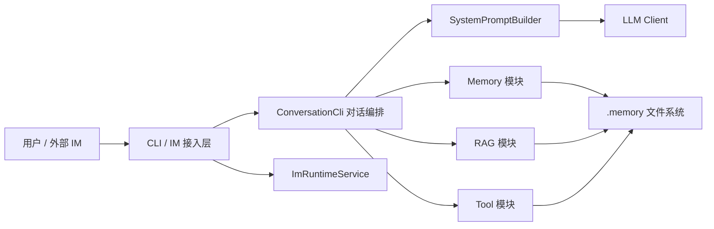
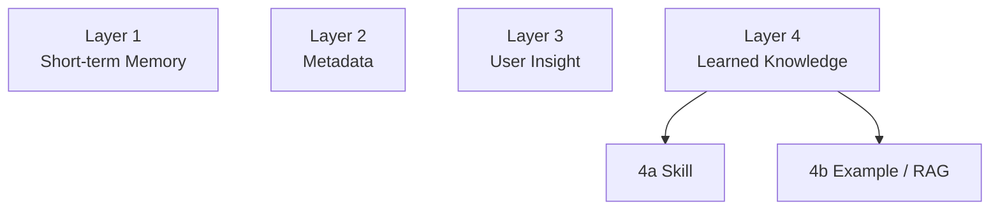
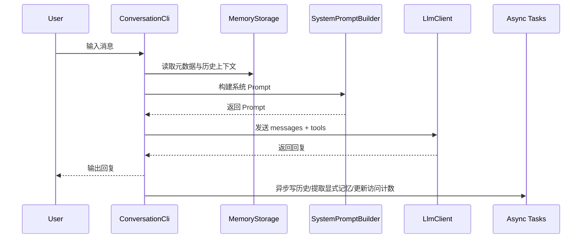
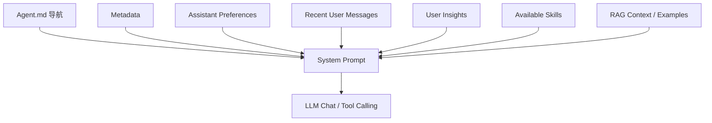
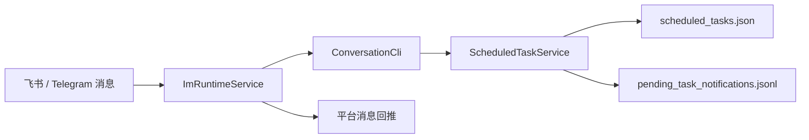

# 基于四层记忆架构的智能记忆管理系统设计与实现

## 摘要

随着大语言模型在问答助手、编程助手和个人智能体等场景中的广泛应用，用户对系统连续对话能力、长期个性化能力以及历史经验复用能力提出了更高要求。然而，单纯依赖模型上下文窗口的对话系统通常存在历史信息易遗失、用户画像难沉淀、过往案例难复用等问题，导致系统在多轮长期交互中表现不稳定。针对上述问题，本文设计并实现了一种基于四层记忆架构的智能记忆管理系统 Memory Box。该系统以 Java 与 Spring Boot 为基础框架，以 LangChain4j 和 OpenAI 格式接口为模型接入方式，围绕短期记忆、元数据、用户洞察和持续学习知识四个层次构建统一的记忆组织机制，并通过 Skill 按需加载、向量检索增强生成、工具调用和 IM 接入等能力实现工程化落地。

本文首先分析了智能对话系统在长期交互场景下面临的关键问题，并在此基础上提出四层记忆架构，将即时上下文、静态偏好、长期画像和可复用经验分层管理，降低不同类型信息混杂带来的维护复杂度。在系统实现方面，本文完成了 CLI 对话主链路、Prompt 动态组装、用户洞察提取、统一写入服务、本地向量检索、定时任务调度以及飞书与 Telegram 接入等核心模块，并采用文件系统作为主要持久化载体，提高了系统可读性、可恢复性和可迁移性。为了验证系统可行性，本文结合单元测试、集成测试和端到端测试对存储、对话编排、工具调用和任务提醒等关键链路进行了验证。测试结果表明，该系统能够较稳定地支持多轮对话中的上下文保持、用户信息沉淀和相似经验召回，具有较好的工程实用价值。

本文工作的主要贡献在于：提出并工程化实现了一种适用于智能体场景的四层记忆架构；设计了以 `Agent.md` 为入口的启动导航与按需加载机制；实现了单文档用户画像与统一写入机制；构建了 Skill、RAG 与 Tool 组合增强的对话体系；打通了 CLI 与 IM 双入口的一体化消息处理链路。最后，本文总结了系统当前存在的不足，并对多模态记忆、记忆治理和多终端协同等未来方向进行了展望。

关键词：大语言模型；记忆管理系统；四层记忆架构；检索增强生成；智能体

## Abstract

With the rapid adoption of large language models in conversational assistants, coding copilots, and personal agents, users increasingly expect systems to maintain dialogue continuity, retain long-term personalization, and reuse prior experience effectively. However, dialogue systems that rely only on the context window often suffer from unstable long-term memory, weak user profiling, and poor reuse of historical cases. To address these issues, this thesis designs and implements Memory Box, an intelligent memory management system based on a four-layer memory architecture. The system is built with Java and Spring Boot, integrates language models through LangChain4j and OpenAI-compatible APIs, and organizes memory into short-term memory, metadata, user insights, and learned knowledge. It further supports engineering-oriented capabilities such as on-demand Skill loading, retrieval-augmented generation, tool invocation, and IM integration.

This thesis first analyzes the major challenges of long-term interactive intelligent systems and then proposes a four-layer memory architecture to separate real-time context, static preferences, long-term user insights, and reusable experience. This layered design reduces coupling among different information types and improves maintainability. In implementation, the system provides a CLI-based conversation workflow, dynamic prompt construction, user insight extraction, unified memory writing, local vector retrieval, scheduled task execution, and integration with Feishu and Telegram. The system uses the file system as the primary persistence medium, which improves readability, recoverability, and portability. To validate the feasibility of the system, unit tests, integration tests, and end-to-end tests are conducted on storage, prompt orchestration, tool invocation, and scheduled reminder workflows. The results show that the system can effectively preserve dialogue continuity, accumulate user information, and retrieve relevant past experience in multi-turn interactions.

The main contributions of this work are as follows. First, it proposes and implements a practical four-layer memory architecture for agent-oriented systems. Second, it introduces a startup navigation and on-demand loading strategy centered on `Agent.md`. Third, it realizes a single-document user profile mechanism with unified memory writing. Fourth, it builds a composite enhancement framework that combines Skills, RAG, and Tools. Fifth, it unifies CLI and IM channels into a single conversation processing pipeline. Finally, the thesis discusses current limitations and outlines future directions, including multimodal memory, finer-grained memory governance, and multi-terminal collaboration.

Keywords: large language model; memory management system; four-layer memory architecture; retrieval-augmented generation; intelligent agent

## 第1章 绪论

### 1.1 研究背景

大语言模型具备较强的语言理解与生成能力，已经能够在客服、办公、编程、教育和个人助理等场景中承担复杂交互任务。但在实际应用中，用户与系统之间往往不是一次性问答，而是持续、多轮、跨时间跨度的长期交互。此类交互要求系统不仅能理解当前输入，还应能够结合用户过往偏好、任务上下文、历史经验以及环境信息生成更准确、更个性化的响应。

目前多数基于大语言模型的对话系统仍主要依赖上下文窗口保存信息。这种方式虽然实现简单，但存在明显局限：一是上下文窗口容量有限，长对话中早期信息会被截断；二是不同类型的信息混杂在一起，难以区分即时上下文与长期记忆；三是用户偏好和历史案例难以被结构化管理；四是随着系统功能增加，Prompt 组装逻辑容易失控，系统可维护性下降。对于希望构建长期可用智能体系统的工程实践而言，单纯扩大上下文并不能从根本上解决记忆问题。

因此，如何为大语言模型设计一套结构清晰、可持续演进、可验证且易于落地的记忆机制，成为智能体工程中的一个重要研究方向。本文围绕这一问题，以实际项目 Memory Box 为研究对象，对记忆系统进行分层设计与工程实现。

### 1.2 研究意义

本文的研究意义主要体现在以下几个方面。

首先，在理论层面，本文将对话系统中的信息按照语义性质与生命周期划分为四层，建立了相对清晰的记忆分层模型，有助于避免不同类型信息混杂造成的设计混乱。

其次，在工程层面，本文强调“架构可落地”和“实现可验证”，不仅提出分层方案，还通过 Java、Spring Boot、LangChain4j、本地向量检索、文件持久化和 IM 接入等技术完成了系统原型实现，为类似项目提供了可复用的实现路径。

再次，在应用层面，系统能够在编程助手、个人助理、知识管理和任务提醒等场景中提供连续的长期服务能力，具备较强的扩展潜力。

### 1.3 国内外研究现状

当前围绕大语言模型记忆能力的研究主要集中在三类思路。第一类是上下文压缩与摘要机制，通过摘要减少历史对话占用的上下文长度；第二类是外部记忆机制，通过数据库、向量库或文件系统将对话信息外置保存；第三类是智能体框架中的长期记忆设计，将用户画像、任务状态和工具结果纳入统一管理。

国外相关研究更多关注智能体长期记忆与检索增强生成的结合，通过向量数据库或知识库提升模型对历史知识的访问能力。国内研究则更侧重在业务系统中集成大模型，并逐步关注多轮对话和个性化能力。然而，许多已有方案要么偏理论描述、缺乏完整工程实现，要么依赖复杂基础设施，不利于在中小规模项目中快速落地。

基于此，本文选取文件系统与本地向量索引作为主要持久化手段，在保证系统可实现和易维护的前提下，探索一种适合毕业设计场景的智能记忆系统实现方案。

### 1.4 研究内容

本文围绕 Memory Box 系统开展研究，主要内容包括：

1. 分析长期对话系统对记忆能力的需求，提出四层记忆架构。
2. 设计系统总体架构、模块划分、数据存储方式与 Prompt 组装策略。
3. 实现对话主链路、用户洞察提取、统一记忆写入、Skill 按需加载、RAG 检索、定时任务和 IM 接入等核心功能。
4. 构建测试方案，对系统关键模块进行验证，并分析测试结果。
5. 总结系统的实际效果、存在问题与后续优化方向。

### 1.5 论文结构

全文共分为八章。第1章介绍研究背景、意义、现状与本文工作。第2章介绍系统实现依赖的关键技术。第3章分析系统需求与可行性。第4章阐述系统总体设计。第5章说明系统详细设计与实现。第6章给出系统测试与结果分析。第7章总结全文工作并讨论不足与展望。摘要与 Abstract 分别概括中文和英文研究内容。

## 第2章 相关技术与理论基础

### 2.1 Spring Boot 框架

Spring Boot 是面向 Java 应用开发的快速构建框架，能够提供自动装配、配置管理、依赖注入和组件化开发能力。本文系统采用 Spring Boot 3.2.0 作为基础框架，用于组织 CLI、IM、Task、Memory、RAG、Prompt 与 LLM 等模块。借助其组件管理与配置机制，系统可以将对话编排、定时调度和外部接口集成为统一运行时。

### 2.2 LangChain4j 与 OpenAI 格式接口

LangChain4j 是 Java 生态下较常用的大模型应用开发库，支持聊天模型、工具调用、嵌入模型和结构化输出等能力。本文通过 LangChain4j 接入兼容 OpenAI 协议的模型接口，完成以下工作：一是发送基础聊天请求；二是实现带工具的多轮对话；三是基于 Schema 获取结构化提取结果；四是接入本地嵌入模型完成语义检索。

### 2.3 检索增强生成技术

检索增强生成（Retrieval-Augmented Generation，RAG）是一种通过外部知识检索增强模型回答质量的方法。其典型流程包括文本向量化、相似度检索和上下文注入。本文将 RAG 用于召回历史记忆和案例经验：系统将用户洞察与案例内容写入 `vector_store.json`，在对话中根据当前消息执行相似度检索，再将相关结果注入 Prompt，从而提升模型在相似问题上的复用能力。

### 2.4 文件系统持久化

与使用关系数据库或专用向量数据库的方案相比，文件系统持久化具有结构直观、便于调试、迁移成本低和人工可读性强等特点。本文系统采用 `.memory/` 目录保存元数据、用户画像、对话历史、任务数据和向量索引等内容。该设计适合中小规模单用户或轻量多入口智能体场景，也方便毕业设计阶段进行功能验证和演示。

### 2.5 异步任务与定时调度

为了避免对话主线程承担过多写入和提取工作，本文使用异步服务处理历史写入、显式记忆提取和访问计数更新等任务。同时，系统结合 Spring 的调度机制实现夜间记忆提取任务和到期提醒任务。该机制既保证了主链路响应效率，又增强了系统的主动服务能力。

### 2.6 IM 接入机制

除了 CLI 交互，本文还实现了飞书与 Telegram 的接入能力。接入后，系统能够接收外部消息、调用已有对话主链路生成结果，并将回复回推到相应会话。该设计说明系统核心逻辑不依赖单一入口，具有较好的渠道复用能力。

## 第3章 系统需求分析

### 3.1 系统目标

本系统面向长期对话与个性化服务场景，核心目标如下：

1. 在连续多轮对话中保持上下文连续性。
2. 持续沉淀用户偏好、背景和长期习惯。
3. 通过语义检索复用过往经验与案例。
4. 支持工具调用、任务提醒和外部消息入口。
5. 形成可扩展、可维护、可测试的工程结构。

### 3.2 功能需求分析

根据当前实现，系统功能需求可归纳如表3-1所示。

| 编号 | 功能需求 | 说明 |
| --- | --- | --- |
| F1 | CLI 对话与命令交互 | 支持用户在终端中发起对话并执行管理命令 |
| F2 | 短期记忆管理 | 保存最近对话和用户输入日志，支撑上下文连续性 |
| F3 | 元数据管理 | 保存交互元数据、全局控制项和界面设置 |
| F4 | 用户洞察提取 | 从用户表达中提取显式记忆与隐式画像 |
| F5 | Skill 按需加载 | 按名称加载方法论类知识，避免全量注入 |
| F6 | RAG 语义检索 | 从历史记忆和案例中召回相关内容 |
| F7 | 工具调用 | 支持 shell、Python、任务创建等工具能力 |
| F8 | 定时任务提醒 | 支持从消息中识别提醒需求并到时触发 |
| F9 | IM 接入 | 支持飞书与 Telegram 消息收发 |

### 3.3 非功能需求分析

系统除功能需求外，还需满足如下非功能要求。

1. 可维护性：模块边界清晰，避免单一类承担过多职责。
2. 可扩展性：能够在保持主链路稳定的前提下新增工具、渠道与记忆能力。
3. 可恢复性：运行数据以文件形式存储，系统重启后应能恢复状态。
4. 可测试性：核心模块应具备单元测试与回归测试基础。
5. 安全边界：对 shell 与 Python 工具进行能力约束，避免任意执行风险。
6. 可读性：持久化文件应尽可能可人工查看与修改。

### 3.4 可行性分析

#### 3.4.1 技术可行性

项目基于 Java 17、Spring Boot、LangChain4j 和本地嵌入模型实现，技术路线成熟，且当前仓库中已经完成核心功能代码与测试。CLI、IM、Task、Memory、RAG 等模块均已具备可运行基础，因此技术上具有可行性。

#### 3.4.2 经济可行性

系统以本地文件系统和本地嵌入模型为主要支撑，不依赖昂贵的数据库与专有基础设施，开发与部署成本较低，适合作为毕业设计项目落地。

#### 3.4.3 运行可行性

系统支持通过 `.env` 和 `application.yml` 进行运行配置，既可在本地 CLI 模式下工作，也可在 IM 服务模式下运行，部署方式简单，运行门槛较低。

## 第4章 系统总体设计

### 4.1 总体架构设计

系统采用分层与模块化结合的架构方式。逻辑主链路遵循 `cli -> memory/rag -> llm -> prompt` 的依赖方向，避免底层模块反向依赖上层交互逻辑。整体上，系统由启动层、交互层、记忆层、检索层、模型层、工具层和扩展接入层构成。

图4-1给出了系统总体架构示意。

### 4.2 四层记忆架构设计

系统的核心创新点是四层记忆架构。其思想是根据数据的生命周期、语义角色和调用方式，将记忆分为四类，分别承担不同职责。

1. Layer 1：短期记忆。保存最近的对话上下文和用户输入日志，用于当前会话的即时连续性。
2. Layer 2：元数据。保存用户环境、助手偏好、全局控制项和界面设置等半静态信息。
3. Layer 3：用户洞察。保存与用户长期偏好和背景相关的稳定信息，是个性化回复的核心来源。
4. Layer 4：持续学习知识。包括方法论型 Skill 和基于向量索引的历史案例，用于提升系统对相似问题的复用能力。

图4-2为四层记忆架构示意图。

该分层方式的优势在于：一是便于区分“当前对话需要的信息”和“长期沉淀的信息”；二是利于设计不同的读写策略；三是便于后续扩展新的增强能力而不破坏原有架构。

### 4.3 启动导航设计

本文系统并未将所有知识都直接纳入记忆层，而是单独设计了 `Agent.md` 作为会话启动导航文件。该文件不保存用户具体记忆，而用于说明关键上下文文件位置、各类文件职责和默认加载边界。通过在新会话开始时自动加载 `Agent.md`，系统能够在最小上下文开销下快速建立工作地图，从而降低 Prompt 膨胀风险。

### 4.4 模块划分

系统主要模块及职责如表4-1所示。

| 模块 | 主要类 | 职责 |
| --- | --- | --- |
| 启动模块 | `MemoryBoxApplication` | 初始化 Spring Boot 应用与调度能力 |
| CLI 模块 | `CliRunner`、`ConversationCli` | 提供终端交互、命令路由和对话主编排 |
| Prompt 模块 | `AgentGuideService`、`SystemPromptBuilder` | 负责启动导航与系统提示词组装 |
| 记忆模块 | `MemoryStorage`、`MemoryManager`、`MemoryWriteService`、`MemoryExtractor` | 负责记忆读写、队列维护、提取与持久化 |
| 检索模块 | `RagService` | 提供向量索引、检索与统计能力 |
| 工具模块 | `BaseTool` 及其子类 | 为模型提供按需工具调用能力 |
| 任务模块 | `ScheduledTaskService`、`ScheduledTaskReminderJob` | 负责提醒任务创建与触发 |
| IM 模块 | `ImRuntimeService` 及平台适配类 | 提供飞书与 Telegram 接入能力 |
| 模型模块 | `LlmClient`、`LlmExtractionService` | 提供聊天、结构化提取和工具轮转 |

### 4.5 数据存储设计

系统将运行数据统一放置于 `.memory/` 目录下，主要文件如表4-2所示。

| 文件名 | 作用 |
| --- | --- |
| `metadata.json` | 保存元数据、偏好、控制项与 UI 设置 |
| `user-insights.md` | 保存用户长期画像正文 |
| `memory_queues.json` | 保存 Top of Mind 队列状态 |
| `recent_user_messages.jsonl` | 保存近期用户输入日志 |
| `conversation_history.jsonl` | 保存完整对话历史 |
| `vector_store.json` | 保存向量索引与案例内容 |
| `scheduled_tasks.json` | 保存待执行提醒任务 |
| `pending_explicit_memories.jsonl` | 保存显式记忆冲突记录 |
| `pending_task_notifications.jsonl` | 保存待回推任务通知 |

该设计强调“文件可恢复”和“数据可人工查看”。例如，用户画像采用单文档 Markdown 形式保存，便于手工阅读与整体调整；而历史数据和任务数据则采用 JSON 或 JSONL 形式保存，便于程序读写。

### 4.6 核心流程设计

对话处理流程如图4-3所示。

该流程体现了系统主链路的核心原则：主路径只负责读取必要上下文、调用模型和返回结果，而持久化与提取等附属任务尽量异步化，以保证对话响应效率。

## 第5章 系统详细设计与实现

### 5.1 对话主编排与 Prompt 构建

系统对话主入口为 `ConversationCli.processUserMessage()`。该方法负责接收用户输入、读取控制项、整理最近对话、生成 Prompt、调用模型并在对话结束后安排异步记忆任务。该类是 CLI、IM 和定时提醒回流的统一对话主链路，因此在整个系统中具有核心枢纽作用。

具体而言，该方法会先读取 `metadata.json` 中的全局控制项，根据 `use_saved_memories` 和 `use_chat_history` 决定是否启用历史和长期记忆；随后从 `conversation_history.jsonl` 中抽取最近十轮完整对话作为 `messages` 上下文，并将当前用户消息追加到消息列表末尾；然后结合 `Agent.md` 缓存内容、用户画像、Skill 列表、RAG 上下文和工具可用性构造系统 Prompt。

`SystemPromptBuilder` 负责组装系统提示词。其组装顺序体现了系统对不同信息源优先级的设计思想：先给出启动导航，再提供元数据和助手偏好，然后补充近期用户消息、长期用户画像、Skill 加载策略和语义检索结果，最后明确工具调用规则与回复约束。该设计既保留了系统行为的稳定性，也避免了无关信息过度注入。

图5-1给出 Prompt 组装流程。

### 5.2 记忆存储与迁移机制

`MemoryStorage` 是系统中最基础的存储组件，负责 `.memory/` 目录初始化、默认文件创建、旧数据迁移以及多类运行数据读写。该类在构造阶段会自动创建存储目录，并完成旧版 `implicit_memories.json` 到 `user_insights.json`、以及进一步到 `user-insights.md` 的迁移初始化。这说明系统在设计时充分考虑了版本演进过程中的兼容性问题。

在短期记忆方面，系统使用 `recent_user_messages.jsonl` 保存用户输入滚动窗口，使用 `conversation_history.jsonl` 追加保存完整对话历史。前者便于快速读取近期用户表达，后者便于长期追踪和后续分析。为了降低并发写入带来的文件损坏风险，部分写入过程采用临时文件 + 原子替换的方式完成。

在长期画像方面，系统采用单文档 `user-insights.md` 保存用户洞察正文，而不是把画像拆成多个分散槽位文件。该设计具有两点优势：一是更适合对用户画像进行整体叙述和统一改写；二是便于人工阅读，不会因为槽位过多而导致结构碎片化。对于仍需保留结构化状态的部分，则通过 `memory_queues.json` 和内嵌状态注释维持兼容。

### 5.3 用户洞察提取与统一写入

用户洞察的来源分为显式提取和隐式提取两类。显式提取主要针对用户直接表达的偏好、背景或约束，例如“不爱吃鱼”“喜欢简洁回答”等；隐式提取则通过对历史会话进行整体分析，识别更稳定的长期画像信息。

`MemoryExtractor` 负责对提取流程进行编排，本身不直接承担大模型通信逻辑，而是将结构化提取能力委托给 `LlmExtractionService`。这种设计使“提取业务”和“模型通信”解耦，有利于控制职责边界。提取出的结果会补齐 `memory_type`、`source`、`hit_count`、`created_at` 等默认字段，以保证后续存储一致性。

`MemoryWriteService` 是系统统一写入入口，其核心作用是将记忆对象构造、持久化、Top of Mind 队列更新和 RAG 索引写入整合为一个闭环。通过统一入口，系统避免了不同模块各自写文件所导致的逻辑重复与状态不一致问题。写入流程包括：构建 `Memory` 对象、写入用户画像、更新访问时间、在开启 RAG 时同步写入向量索引。该设计体现了本文在工程实现中对“一致性优先”的重视。

### 5.4 Skill、RAG 与工具调用机制

持续学习知识层被拆分为 Skill 与 Example 两部分。Skill 主要表示方法论型知识，以 Markdown 文件形式存放在 `.memory/skills/` 目录下，由 `SkillService` 提供列举、读取、保存和删除能力。与传统将所有辅助知识直接注入 Prompt 的方式不同，本文系统只向模型提供 Skill 名称列表，并通过 `load_skill(name)` 工具实现按需读取。这样既能保留方法论知识的可用性，又能有效降低 Prompt 冗余。

RAG 能力由 `RagService` 提供。该服务内部维护单文件向量索引 `vector_store.json`，使用 `all-MiniLM-L6-v2` 作为本地嵌入模型。系统支持记忆索引、全量重建、语义搜索、案例检索和上下文构建等功能。其工作原理是先将文本内容编码为向量，再通过余弦相似度执行检索，并将达到阈值的结果按分值排序返回。由于系统直接对记忆与案例内容进行向量化，因此能够在相似问题出现时快速召回相关信息。

工具能力由 `BaseTool` 及其子类构成，当前主要包括 `load_skill`、`search_rag`、`run_shell`、`run_shell_command`、`run_python_script` 和 `create_task` 等接口。工具机制让模型不再局限于纯文本生成，而能够在受控范围内读取文件、执行脚本、搜索知识和创建任务，从而把“对话能力”扩展为“操作能力”。

### 5.5 IM 接入与定时任务扩展能力

为了证明系统核心能力可复用于多入口场景，本文实现了 IM 接入模块。`ImRuntimeService` 统一处理外部消息，它在收到 `IncomingImMessage` 后会调用 `ConversationCli.processUserMessage()` 获取回复，再根据平台类型调用对应客户端将结果发回。通过该设计，CLI 与 IM 实际上共享同一套对话主逻辑，仅入口和输出渠道不同，体现了系统架构的良好复用性。

在任务能力方面，`ScheduledTaskService` 支持从自然语言中提取提醒需求，也支持由前端直接传入标题、时间和执行命令创建任务。任务被写入 `scheduled_tasks.json` 后，调度器会周期性扫描并触发到期任务。若任务配置了执行命令，系统还会在受控 shell 环境中执行命令并记录输出，随后把触发结果写入待通知队列，供 IM 会话回推。该机制说明系统已经具备一定的主动服务能力，而不仅仅是被动问答系统。

图5-2展示 IM 与任务回流过程。

## 第6章 系统测试与结果分析

### 6.1 测试环境

系统测试环境为本地 macOS 开发环境，项目通过 Maven 构建，运行时使用 Java 17 及以上版本。系统依赖的核心框架包括 Spring Boot 3.2.0、LangChain4j 0.35.0 和 JUnit 5。测试过程采用 `mvn test -q` 执行自动化测试。在当前环境下，显式设置 `JAVA_HOME` 后，测试命令可正常通过。

### 6.2 测试内容与方法

为了覆盖系统核心功能，本文将测试分为四类：存储与迁移测试、对话与 Prompt 编排测试、工具调用与任务创建测试、IM 接入与端到端测试。

#### 6.2.1 存储与迁移测试

该类测试主要验证 `MemoryStorage` 是否能正确初始化 `.memory/` 目录、创建默认文件、完成历史数据迁移，并保证用户画像和任务文件的读写正确性。通过该类测试，可以证明系统在首次启动、版本升级和正常运行阶段均具备较好的数据兼容能力。

#### 6.2.2 对话与 Prompt 编排测试

该类测试主要对应 `ConversationCliTest` 与 `SystemPromptBuilderTest`。测试重点包括：首次会话是否注入 `Agent.md` 导航、后续轮次是否避免重复注入；在启用 Skill 时是否正确暴露 `load_skill` 工具；在启用 RAG 时是否正确暴露 `search_rag` 工具；在临时模式和历史控制开关切换时是否保持对话行为符合预期。

#### 6.2.3 工具调用与任务创建测试

该类测试主要覆盖 `ToolCompositionTest`、`CreateTaskToolTest`、`PythonScriptToolTest`、`ShellCommandToolTest` 和 `ScheduledTaskServiceTest`。其中，`CreateTaskToolTest` 用于验证任务创建接口对时间、命令和去重逻辑的处理；`ShellCommandToolTest` 和 `PythonScriptToolTest` 用于验证工具执行结果；`ScheduledTaskServiceTest` 则验证任务触发、执行输出和通知生成等流程。

#### 6.2.4 IM 接入与端到端测试

该类测试主要包括 `FeishuInboundParserTest`、`TelegramInboundParserTest` 和 `RealApiE2ETest`。前两者验证不同平台入站消息的解析正确性，后者作为真实模型接口端到端回归入口，用于在实际 API 条件下验证完整链路可用性。

### 6.3 测试结果分析

依据当前仓库测试结果，系统核心链路已经具备较完整的自动化验证基础。测试覆盖范围涉及存储、记忆管理、Prompt 构建、工具调用、任务调度、IM 消息解析和真实 API 回归等多个方面，能够较全面地证明系统并非停留在架构设计层面，而是完成了实际可运行的工程原型。

表6-1给出主要测试用例与验证目标。

| 测试类 | 验证目标 |
| --- | --- |
| `MemoryStorageTest` | 存储初始化、文件读写、迁移逻辑 |
| `MemoryManagerTest` | 队列访问更新与清理逻辑 |
| `ConversationCliTest` | 对话编排、Skill/RAG/任务工具暴露 |
| `SystemPromptBuilderTest` | Prompt 组装结构与内容 |
| `CreateTaskToolTest` | 任务创建参数解析与任务落盘 |
| `ShellCommandToolTest` | shell 命令执行与输出 |
| `PythonScriptToolTest` | Python 脚本执行能力 |
| `ScheduledTaskServiceTest` | 提醒任务创建、去重、触发与通知 |
| `FeishuInboundParserTest` | 飞书消息解析 |
| `TelegramInboundParserTest` | Telegram 消息解析 |
| `RealApiE2ETest` | 真实模型接口回归 |

从功能效果上看，系统已经能够实现以下目标：一是在多轮对话中保持最近上下文连续性；二是在长期交互中逐步形成用户画像；三是在遇到相似问题时通过检索增强复用历史经验；四是在外部消息渠道中复用同一对话主链路；五是在需要时创建并触发提醒任务。因此，本文提出的架构与实现方案在毕业设计场景下是可行且有效的。

### 6.4 存在的测试局限

尽管当前测试基础较完整，但仍存在若干局限。首先，系统尚未构建系统化的量化评测指标，例如记忆命中率、召回准确率和响应延迟统计等，当前验证更多偏向功能正确性。其次，真实 API 的端到端测试属于手动回归入口，自动化程度仍可进一步提高。再次，当前测试更关注单机场景，对多用户并发和长周期运行稳定性的验证仍然有限。

## 第7章 总结与展望

### 7.1 工作总结

本文围绕大语言模型在长期交互场景中的记忆问题，设计并实现了一个基于四层记忆架构的智能记忆管理系统 Memory Box。系统通过对短期上下文、元数据、用户洞察和持续学习知识进行分层管理，解决了传统上下文窗口式对话系统难以支撑长期个性化交互的问题。在此基础上，本文完成了 CLI 对话链路、Prompt 动态组装、用户洞察提取、统一写入服务、Skill 按需加载、本地 RAG 检索、定时任务调度和 IM 接入等一系列工程实现，并通过自动化测试和端到端回归验证了系统核心功能的可用性。

从实现效果来看，本文工作的价值主要体现在三个方面。其一，系统架构清晰，层次边界明确，便于持续迭代。其二，系统功能完整，不仅能记忆用户信息，还能调用工具、执行任务并扩展到外部消息入口。其三，系统实现与文档保持一致，具备较强的工程复现性，适合作为毕业设计项目成果。

### 7.2 不足之处

尽管系统已经具备较完整的原型能力，但仍存在若干不足。首先，当前用户画像虽然采用单文档维护，便于整体描述，但在细粒度冲突消解和版本比较方面仍有提升空间。其次，RAG 检索当前采用单文件向量索引，适合轻量场景，但在更大规模数据环境下可能面临性能瓶颈。再次，系统当前主要服务于单用户或轻量多入口场景，对身份映射、多用户隔离和权限控制的支持仍不完善。最后，测试虽然覆盖了核心功能，但尚未形成标准化评测体系。

### 7.3 未来展望

未来可从以下几个方向继续优化本系统。

1. 引入更细粒度的画像更新策略，提升对冲突信息和时间衰减信息的处理能力。
2. 设计更完善的记忆评分与治理机制，使系统能够自动区分高价值记忆与低价值记忆。
3. 扩展多模态记忆能力，将图片、文件和语音等内容纳入统一记忆框架。
4. 加强安全策略与权限隔离，尤其是对 shell、脚本和任务执行能力进行更细致控制。
5. 增加 Web UI 或多终端协同能力，提升系统的人机交互体验。
6. 建立更系统的评测体系，对召回效果、个性化效果和长周期稳定性进行量化分析。

综上所述，本文提出并实现的四层记忆架构为智能体系统中的长期记忆管理提供了一种具有工程可行性的实现思路。随着后续功能完善，该系统有望在更广泛的个人助理、知识管理和智能工作流场景中发挥作用。

## 参考文献（草案）

[1] Spring Boot 官方文档.  
[2] LangChain4j 官方文档.  
[3] OpenAI API 相关文档.  
[4] Lewis P, Perez E, Piktus A, et al. Retrieval-Augmented Generation for Knowledge-Intensive NLP Tasks.  
[5] 项目仓库 `README.md`.  
[6] 项目文档 `开发文档.md`.  
[7] 项目文档 `开发实现process.md`.  
[8] 项目文档 `IM接入使用文档.md`.  

## 附录A 论文图表清单建议

1. 图4-1 系统总体架构图
2. 图4-2 四层记忆架构图
3. 图4-3 对话处理流程图
4. 图5-1 Prompt 组装流程图
5. 图5-2 IM 与任务回流图
6. 表3-1 功能需求表
7. 表4-1 核心模块职责表
8. 表4-2 主要存储文件说明表
9. 表6-1 测试用例与结果表

## 附录B 后续定稿前建议补充内容

1. 按学校模板调整封面、目录、页眉页脚和章节编号格式。
2. 将参考文献补充为学校要求的 GB/T 7714 格式。
3. 根据答辩展示需要补充系统运行截图、日志截图和 CLI 交互截图。
4. 如需强化实验部分，可增加一次典型对话案例分析与提醒任务触发案例分析。
